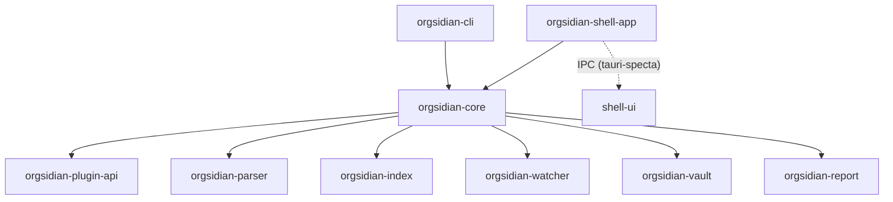

# Architecture

This file is the elevator-pitch map of the Orgsidian codebase. For the full design rationale, see [`_bmad-output/planning-artifacts/architecture.md`](./_bmad-output/planning-artifacts/architecture.md) — 55 numbered Logical Decisions that this document only summarizes.

## Top-level summary

**Orgsidian** is a cross-platform desktop **planner-and-knowledge** application that opens, edits, and organizes Emacs org-mode `.org` files without requiring Emacs itself. It is local-first, OSS (MIT), and format-faithful: every save round-trips through a `tree-sitter-org` parser that preserves byte-level fidelity so files remain consumable by Emacs, Vim, Doom, vanilla editors, or any future org-mode tool. The marketing wedge is "task-first" (a planner powered by org-mode); the engineered core is the integration itself — tasks, time, and notes treated as peers on a unified editor surface.

The repository is a **9-crate Cargo workspace** under [`crates/`](./crates/), paired with a sibling **JavaScript workspace** at [`shell-ui/`](./shell-ui/) that hosts the React 19 + TypeScript renderer. The Rust workspace is organized around a deliberate LEAF discipline: domain leaves (`parser`, `index`, `watcher`, `vault`, `plugin-api`, `report`) carry no inbound dependencies from each other; everything fans out from `orgsidian-core`, and the two top-level binaries (`orgsidian-cli`, `orgsidian-shell-app`) reach the leaves only through `core`. This is enforced at CI time by `cargo deny check graph` (LD-37), and the Mermaid graph below is its human-readable rendition.

The Rust→TypeScript bridge is **Tauri 2.x with `tauri-specta` typed IPC** (Story 1.4): every shell-app command exposes a generated TypeScript signature in [`shell-ui/src/lib/tauri.ts`](./shell-ui/src/lib/tauri.ts) so the renderer never speaks to the Rust side via untyped JSON. The shell-app process owns disk I/O, the SQLite index, the filesystem watcher, and the plugin registry; the webview holds the editor, dashboards, agendas, capture window, and settings UI. The cross-language edge (`shell-app → shell-ui`) is the only non-Cargo dependency in the workspace, and the Mermaid graph annotates it as dashed.

The project's **operational posture** is local-first by hard rule. LD-18 (CSP) blocks every outbound HTTP request from the renderer except for explicitly allowlisted asset hosts. LD-23 reaffirms **zero telemetry** — no analytics, no crash-reporting beacons, no first-run pings — for the entire v0.1 → v1.0 horizon. LD-40 makes **TOML the authoritative settings store** (`~/.orgsidian/settings.toml`), with the renderer reading a thin hybrid boundary that never mutates the file directly. Together those decisions mean an Orgsidian install is a black box: a user's `.org` files plus a SQLite derived index plus a TOML settings file, none of which leak off-disk.

## Crate dependency graph

The LEAF discipline is visible at a glance: `parser`, `index`, `watcher`, `vault`, `plugin-api`, and `report` are sinks with no outbound edges (and no inbound edges from each other); `core` is the single fan-out hub; `cli` and `shell-app` reach the leaves only through `core`. The dashed `IPC (tauri-specta)` edge from `shell-app` to `shell-ui` is the sole cross-language link.

## What lives where

| Crate | One-line responsibility |
|---|---|
| `orgsidian-parser` | `tree-sitter-org` wrapper + semantic layer (TODO cycling, drawers, timestamps, link types) + round-trip-faithful serializer. |
| `orgsidian-index` | SQLite derived index (rusqlite + deadpool, FTS5) — agenda, search, backlinks, graph queries. |
| `orgsidian-watcher` | `notify-rs` filesystem watcher with debounce; surfaces external-edit events to `vault`/`core`. |
| `orgsidian-vault` | Atomic-write subsystem (`atomic-write-file`), dirty-buffer manager, single-writer discipline, refile subtree primitives. |
| `orgsidian-plugin-api` | Public trait surface (`OrgsidianPlugin`, `Event`, `HookOutcome`, `PluginContext`) — leaf crate, the only one slated for crates.io publication at v1.5+. |
| `orgsidian-report` | Project report export — Typst-as-library + bundled fonts + parallel HTML renderer. |
| `orgsidian-core` | The hub: orchestrators, plugin registry, clock, starter-vault templates, public API the binaries consume. |
| `orgsidian-cli` | `orgsidian` binary — `parse-file`, `index init/rebuild/stats`, future commands. Reaches leaves through `core`. |
| `orgsidian-shell-app` | Tauri 2.x host — owns the webview, IPC commands, system tray, global shortcuts, plugin loading. |
| `shell-ui` | React 19 + TS + Tailwind 4 + shadcn + forked TanStack Router renderer — editor (CodeMirror 6), dashboards, agendas, capture, settings, merge dialog. |

## Full design rationale

For the full 55-Logical-Decision rationale (license, IPC, parser, index, watcher, vault, plugin pattern, supply-chain hygiene, panic isolation, perf gates, a11y gates, i18n, Conventional Commits, GitHub Issues sync), see [`_bmad-output/planning-artifacts/architecture.md`](./_bmad-output/planning-artifacts/architecture.md). That document is the single source of truth; this file is the elevator pitch.
