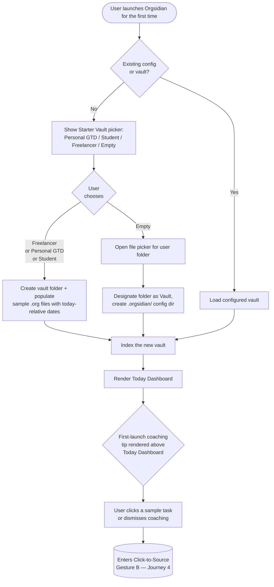
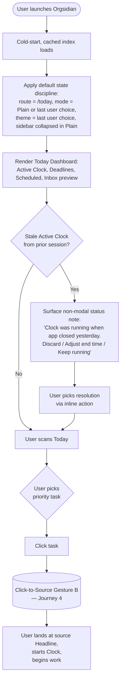
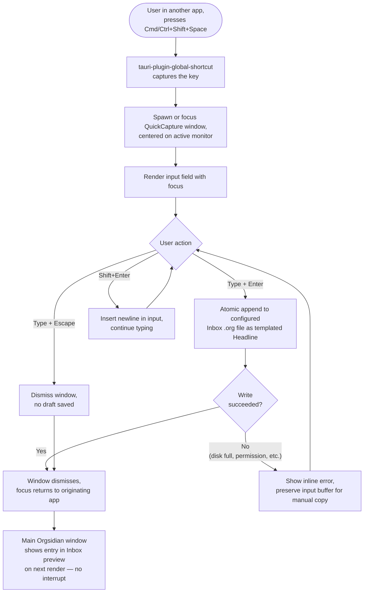
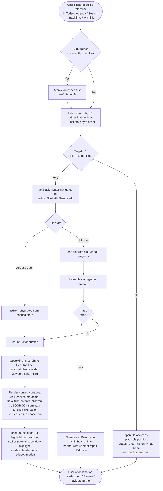
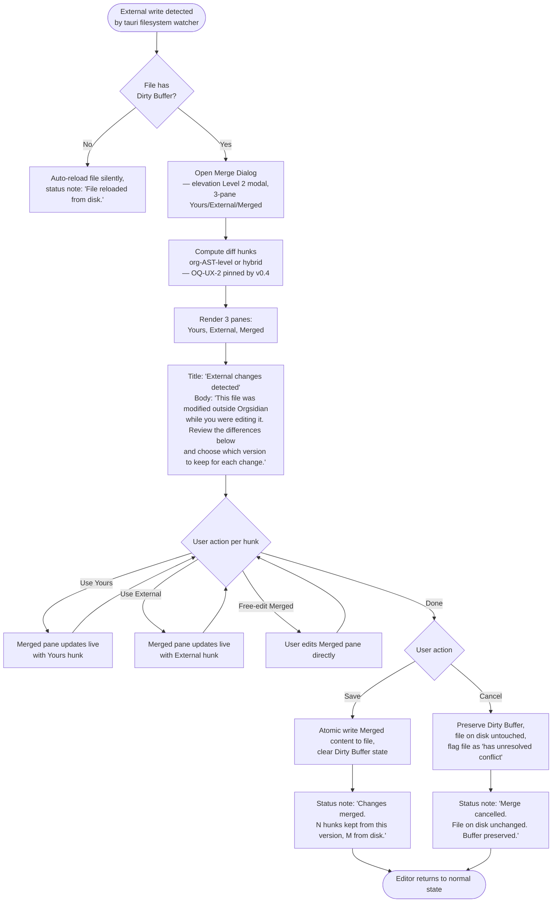
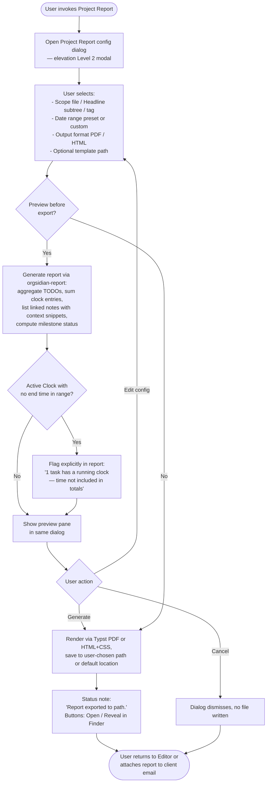

# UX Design Specification — Orgsidian

**Author:** Tiziano
**Date:** 2026-05-20

---

## Executive Summary

### Project Vision

**Orgsidian** is an OSS cross-platform desktop application (macOS / Linux / Windows) for **org-mode without Emacs**, built on Tauri 2.x + Rust core + React 19 + CodeMirror 6, MIT-licensed, 100% spec-driven AI-agent implementation (LD-1..LD-55 locked).

The **UX/marketing wedge** is *"one object, three views"*: in Orgsidian a `* TODO` and a note are **the same object** (org-headline) — backlinkable, schedulable, time-trackable in the same file. The differentiator against Obsidian / NotePlan / Logseq is not a feature list ("we have tasks + time + notes") but the **architectural model**: competitors *simulate* unification via plugins or composition; Orgsidian inherits it from org-mode. This is a moat competitors cannot replicate without rewriting their core.

**Explicit positioning**: deliberately AI-free through v1.0. AI / local-LLM hook evaluation is a post-launch concern and does not condition the v0.1 → v1.0 roadmap.

**Non-negotiable flags (PRD §1.5, §7)**: filesystem source-of-truth; byte-identical round-trip (FR-2) as the trust contract; no accounts; no telemetry by default; Single Writer Rule + Merge Dialog never silent-overwrite. **Cold-start lands on Today Dashboard** (default, configurable in Settings).

Public roadmap: v0.1 Alpha (months 3-6) → v0.5 Beta (months 7-12, wow-demo Project Report) → v1.0 (months 13-18, public launch + Windows + Interactive Tutorial).

### Target Users

**Lighthouse persona — the Independent Knowledge Worker** (freelancer / consultant): manages projects end-to-end (client work, deliverables, time tracking, invoicing prep, knowledge across engagements). CLI-confident but *not an Emacs user*; has tried Obsidian (friction with tasks) or a planning tool (missing the note depth). Demands local plain-text, data ownership; refuses SaaS, cloud accounts, the Emacs learning curve.

**Natural secondary audiences**: students, researchers, non-Emacs GTD enthusiasts, developers managing personal projects. They follow naturally if the lighthouse is served excellently.

**Narrative personas (PRD §2.4)**: *Mara* (UJ-1, opens her day on Today Dashboard), *Tiziano-dogfooder* (UJ-2, Quick Capture <1s), *Sofia* (UJ-3, Project Report PDF at end of engagement), *Alex* (UJ-4, first-launch + Starter Vault), *Riccardo* (UJ-6, Search + Backlinks across two years of notes).

**Bias to monitor (non-persona)**: Tiziano-as-author-who-dogfoods is an influential voice but is **not** equivalent to the lighthouse persona. Decisions driven by developer frictions should be tracked (dogfood debt log) to avoid skewing the product toward the "me" case.

**Non-users for v1 (PRD §2.3)**: Emacs power users, mobile-first users, teams needing real-time collaboration, markdown-only users, enterprise SSO/audit users.

### Key Design Challenges

1. **Workflow-first vs syntax-first.** The barrier to org-mode is the workflow, not the syntax. Onboarding must demonstrate value (task + clock + capture + agenda) within the first 5 minutes **without a tutorial**, via Starter Vault + Inline Coaching. UX that teaches `*** TODO` before showing "open your day, clock, capture, see tomorrow" fails the lighthouse persona.

2. **Default state discipline at cold-start.** Today Dashboard is the confirmed landing surface at the Nth launch. The residual challenge is *internal*: which focus state, which expanded section, which call-to-action prevails when Today contains 0 / 1 / many items? A tired Mara at 8:47 AM should not have to map 12 visible states (3 editor modes × 2 UI modes × 2 platform contexts) — she should land in one sensible, predictable state.

3. **Keyboard idiom arbitration.** The lighthouse persona is CLI-confident but **non-Emacs**: fluent in Vim, VS Code, Obsidian. Serving both languages (FR-5 opt-in Emacs keybindings + cross-platform defaults) requires *deciding which orthodoxy is the default* and which is opt-in. Defaulting to Emacs alienates the newcomer; inventing from scratch alienates the migrating power user.

4. **First 90 seconds after vault open.** Not first-time onboarding, but the **tenth daily launch**: between `cmd+space → orgsidian` and *"I see something useful and know what to do next"*, the cognitive budget is <3s. This is the most important UX metric for retention of the lighthouse persona.

5. **Trust-at-first-merge-conflict.** The first Merge Dialog a user sees after a git-sync conflict is the make-or-break adoption moment — *"Does Orgsidian deserve my 5 years of notes?"*. This is crisis UX, not routine: 3-pane Yours / External / Merged with hunk-level selection, live preview, reassuring copy, never-silent-overwrite. Treated as its own challenge, not subsumed into a generic "Merge Dialog".

6. **Inline Coaching without becoming Clippy.** The centralized `coachingRegistry` is powerful but at risk of noise. An explicit **death curve** is required as a design principle: coaching disappears implicitly when an action is completed twice without error. Manual dismissal is a safety net, not the primary mechanism.

7. **Accessibility WCAG AA from v0.1, not v1.0.** A keyboard-first app inhabited by technical users carries high OSS reputational risk if a11y arrives late. Keyboard nav completeness (Tab/Shift-Tab, Escape, focus visible) + axe-core snapshot (zero critical/serious violations) as a hard CI gate from v0.1, not a "best-effort v1.0" NFR. Full screen-reader support remains a manual release gate.

8. **Project Report as retention proof, not acquisition wedge.** A freelancer does not pick Orgsidian *for* the PDF report (Notion exports + Toggl reports own that space). The PDF is the **proof that the data → output pipeline works**, and the HN-friendly demo for v0.5 Beta. The sellable narrative is "your week of work, told by your editor", not "I export PDFs".

### Design Opportunities

1. **Today Dashboard zero-config at first launch.** The differentiator is not "it exists" but **"it is populated and sensible day-1, with no tweaking"**. Obsidian Homepage requires plugins + setup; NotePlan has a native Today but is macOS-only, closed-source, subscription-gated. The slice (desktop-native OSS cross-platform org-faithful with zero-config Today Dashboard) is genuinely unclaimed.

2. **Plain ↔ Power Mode reveal as the primary distributed onboarding mechanism.** More than coaching and empty states. Turn the toggle into a *delight* moment (reveal animation, side-by-side surface comparison) rather than a hidden Settings checkbox. This is the mechanism that teaches org-mode progressively without a tutorial.

3. **Local-first as a visible artifact.** A discreet persistent badge (e.g., status bar): *"vault: ~/Documents/notes — 45 files, last modified 2 min ago"*. Turns an invisible promise (no telemetry, no cloud) into a continuous trust signal. Reinforces the OSS-anti-SaaS narrative every session, not just in the README.

4. **Critical empty states (scoped to 5).** Not distributed onboarding across 30+ states, but 5 deliberate moments: **empty Today** ("No tasks scheduled for today — nice."), **empty Agenda**, **Search no-results**, **freshly created Vault**, **empty Capture history**. Each with contextual coaching and a suggested next-action.

5. **Project Report as HN-friendly narrative demo.** Tweet/screenshot-ready: *"I tracked my time in my editor — here's the client report in 3 clicks."* The v0.5 Beta roadmap anchor that disciplines the loop clock-in → time tracking → aggregation → render. Not selling-via-need (need is already covered by Notion/Toggl), but selling-via-spectacle to a technical audience.

### Acknowledged Architectural Constraints (Inputs, Not Challenges)

The following decisions are already locked in the architecture and are not open UX questions, but constraints to respect:

- **Day-1 Org UI Kit** (architecture LD): `TodoStateCycler`, `TagPillEditor`, `OrgDatePicker`, `PropertyDrawer`, `ClockEditor`, `HeadlineRenderer`, `ScheduleDeadlineBadge` exist as components from v0.1. The *visual branding priority* of these widgets is a v1.0+ concern.
- **`--org-*` theming tokens as public contract from v0.5** (LD-51): UX must express itself in semantic tokens (`--org-headline-h1-fg`, `--org-accent-todo`), never structural ones (`--org-blue-500`).
- **Three Editor Modes** (Raw / Pseudo-WYSIWYG / Split) + **Plain/Power UI Mode** + **opt-in Emacs keybindings**: matrix surfaced by the PRD, not reducible. Default selection: Pseudo-WYSIWYG + Plain + native keybindings + light theme.
- **Quick Capture in a separate Tauri window** (LD-28) with end-to-end budget <1s (FR-10): performance commitment, decomposed into 4 sub-budgets (see test strategy in later steps).
- **Large-vault indexing UX** (LD-42): handled by the architecture for 10k/25k/50k file scaling. Not a first-class UX opportunity for the lighthouse persona (typical vault: 200-2000 files).

## Core User Experience

### Defining Experience

Orgsidian's core experience is built around **three atomic actions** that compose every higher-level workflow:

1. **Capture** — friction-less entry of a thought / task / reference into the system. The defining surface is **Quick Capture** (FR-10, global hotkey, separate Tauri window, <1s end-to-end budget decomposed into four measurable sub-budgets — Rust persist, IPC roundtrip, window cold-start, OS-level hotkey-to-disk); the secondary surface is in-place capture from the Editor.

2. **Act on a Headline** — every meaningful *mutation* targets an org-headline as the workflow primitive: cycle its TODO state, schedule it, deadline it, clock into it, complete it, link it, **refile it (move between files / outline levels)**, restructure the outline around it. The Headline is the atom of the workflow; the same mutation works the same way regardless of which file the Headline lives in.

3. **Review** — non-mutating *aggregation* of the corpus. Manifestations: **Today Dashboard** (today's slice), **Agenda** (date-ranged scheduled view), **Search** across the Vault, **Backlinks panel** from the current Headline, **Project Report** (engagement-scoped time + completion summary). Review is the JTBD that the freelance lighthouse persona executes weekly (client reports), daily (Today), and at every context switch (Backlinks). Compressed into "Search + Project Report" it would be under-served; promoted to its own atomic action it earns its own surface family.

Three actions, three verbs, three surface families. Onboarding teaches three primitives, not a feature list.

**Wedge in one frame**: composing these three actions on the same org-headline is what makes *"one object, three views"* visible — Today (planner view) → click → Editor (notes view) → toggle outline → LOGBOOK (time view), all the same headline, no translation, no sync layer.

The most-frequent user action across the daily session, weighted by persona: **Headline-state manipulation** under Act (toggle TODO, schedule, clock). The single most-defining product moment: **opening Today Dashboard at cold-start and seeing one's actual day already laid out** — the proof that Capture + Act + Review compose into a unified workflow.

**Architecture-UX invariant.** The Plugin API event surface (LD-26: `FileOpened`, `HeadlineEdited`, `ClockStarted/Stopped`, `CaptureSubmitted`) is Headline-scoped or Capture-scoped by construction. The architecture has independently converged on the same atomic units the UX declares here. This convergence is load-bearing: every new core command, every plugin event, every IPC must justify itself in terms of Capture / Act / Review — or be flagged as a model deviation worth re-examining.

### Platform Strategy

- **Form factor**: desktop-native, cross-platform across macOS, Linux, and Windows. macOS + Linux ship in v0.1 Alpha; Windows joins at v1.0 (PRD §6.1, §6.3). No web, no mobile in v1 (PRD §5 Non-Goals).
- **Input model**: **keyboard-first with mouse equivalents AND a Command Palette as the canonical discovery surface**. Every action has a one-keystroke shortcut; every action is also reachable from `Cmd/Ctrl+K` with its shortcut hint displayed inline. The non-Emacs lighthouse persona discovers the keyboard idiom incrementally through the palette — no chord muscle memory required at first use.
- **Connectivity**: **offline-by-default**. No core workflow requires the network (PRD §7.1). The only built-in network call is the optional auto-update check (LD-20, disable-able from Settings).
- **Native runtime**: Tauri 2.x — single `main` window (Editor + Today Dashboard + Agenda + Settings + Merge Dialog routed via TanStack Router, LD-29) plus a separate `quick-capture` window (LD-28) optimized for the FR-10 <1s budget. OS integration via the full Tauri 2 plugin set: global shortcut (FR-10), filesystem (scoped to Vault, LD-17), dialog, window-state persistence, clipboard, OS detection (Cmd vs Ctrl).
- **Day-1 onboarding artifact**: a **curated Freelancer Sample Vault** ships with v0.1 Alpha (FR-18 Personal GTD + Student baseline + Freelancer added to v0.1 for the lighthouse persona; PRD §4.5 FR-18 assumption updated). Realistic projects, scheduled items relative to first-launch date, one active clock from "yesterday", a small backlink graph. A new user with zero `.org` files lands on a populated Today Dashboard from the first second.
- **Device capabilities leveraged**: file watcher (fsevents / inotify / ReadDirectoryChangesW per platform), global hotkey, system tray (FR-11), native file pickers, native menus.
- **Sync model**: filesystem-mediated, user-chosen (Git, Syncthing, iCloud, Dropbox, rsync). Orgsidian itself never sends a Vault file off the device.

### Effortless Interactions

Designed to feel zero-thought. Each is a commitment surfaced in the FRs and elevated here to an effortlessness contract:

- **Quick Capture round-trip** — hotkey → entry persisted → focus returned, in <1s. Decomposed into four sub-budgets for testability (FR-10, UJ-2).
- **TODO state cycle** — one keystroke walks the per-Vault TODO state machine. No menu, no dialog.
- **Schedule / Deadline a Headline** — one keystroke opens an inline date picker with shortcut entries (`today`, `+1d`, `+1w`, `next monday`); Enter commits, Esc cancels. The date-shortcut parser is a pure-Rust function with its own unit-test surface, independent of UI (FR-9, UJ-1).
- **Clock in / clock out** — one keystroke toggles the Active Clock on the current Headline; new clock auto-stops the previous one. Atomicity under spam-click is a property-tested invariant (FR-8).
- **Refile a Headline** — one keystroke prompts a target picker (other file / Headline in current file / nested level); commits as standard org refile, persists across restarts. The triage primitive for the inbox JTBD.
- **Jump to Today** — one keystroke from anywhere returns to Today Dashboard with state preserved (scroll, filters, expansions). The cold-start lands here by default.
- **Open Command Palette** — `Cmd/Ctrl+K` from anywhere; fuzzy search across all commands; shortcut hints visible inline. The discovery surface for the non-Emacs persona.
- **Open Search** — `Cmd/Ctrl+P` opens full-vault FTS5-backed search; first 10 results <100ms, full 50 <200ms (refined from FR-12 for streaming-results coherence) (UJ-6).
- **Follow a backlink** — single click or single keystroke navigates from the Backlinks panel to the source Headline (FR-13).
- **Switch Editor Mode** — `Cmd/Ctrl+Shift+M` cycles Raw / Pseudo-WYSIWYG / Split; per-file persistence (FR-3).
- **Reload from disk on clean buffer** — fully automatic; the user sees a status note via `aria-live="polite"`, no dialog (FR-16, UJ-5).
- **Resume an interrupted indexing scan** — fully automatic on next launch; no user prompt, no re-start-from-zero (LD-42).

### Critical Success Moments

The moments that decide whether Orgsidian earns adoption:

1. **First Today Dashboard.** Two paths to the same moment:
   - *Existing-vault path:* the user points Orgsidian at an existing `.org` folder; within seconds Today shows today's scheduled items, deadlines, inbox preview, last-running clock. If it matches the user's actual day, trust forms instantly.
   - *Sample-vault path (lighthouse default):* the new user with no `.org` files picks the Freelancer Sample Vault; Today is populated from the first second with realistic content. Acquisition moment for users who do not arrive with a vault.

   In both paths, the dashboard must be populated and sensible day-1, with no tweaking (UJ-1, UJ-4, UJ-5, FR-6, FR-15, FR-18).

2. **First Quick Capture.** Hotkey → typed thought → Enter → entry visible in Inbox on next Orgsidian focus, no focus stolen from the originating app. Sub-second perceived. *"This is the friction-less capture I've been missing."* (UJ-2, FR-10.)

3. **First TODO cycle on an existing Headline.** One keystroke moves the state and writes the change to disk. The user opens the file in another editor: the change is there, byte-perfect, no proprietary metadata. The filesystem-source-of-truth promise is proven, not narrated.

4. **First merge conflict survived.** External write to a Dirty Buffer triggers the Merge Dialog (3-pane Yours / External / Merged, hunk-level selection, live preview). The user picks hunks, saves, both editors agree. *No data was lost; both edits were honored.* The moment trust is committed for five years of notes (UJ-5, FR-16).

5. **First Project Report.** End of week, the user clicks Project Report → date range → PDF. Output is printable, readable, accurate; clocked hours sum correctly; a running Active Clock is flagged honestly. The user attaches it to a client invoice. v0.5 Beta wow-demo, retention proof, HN-friendly demo (UJ-3, FR-14).

6. **First Plain → Power reveal.** The user toggles Power Mode; the advanced surfaces appear with a deliberate reveal (or side-by-side comparison) so the user *understands what just became available*. Progressive disclosure as delight, not a Settings checkbox.

7. **First search across two years of notes.** `Cmd+P kubernetes ingress` → results in <200ms → click → the forgotten client engagement re-appears via Backlink. The vault becomes a living archive (UJ-6, FR-12, FR-13).

8. **First crash recovery without loss.** The app crashes (or is killed, or power-loss interrupts a save). On relaunch, `.tmp` orphans are cleaned up automatically; the user sees the file in the state of the last atomic write; a status note announces "Recovered from interruption — no data lost." This is the moment Single Writer Rule + atomic-write earn their keep beyond architecture-doc language. Not glamour, but load-bearing for trust (LD-41 failure-mode catalog).

### Experience Principles

The cross-cutting commitments that resolve micro-decisions throughout the UX work. Complement (do not replace) PRD §1.5 Design Principles.

1. **The Headline is the atom.** Every command targets, transforms, or navigates a Headline (under Act) or operates on the corpus (under Review). Capture is the third primitive, the entry vector. There is no fourth model.

2. **Keyboard wins, mouse follows, palette discovers.** Every core action has a memorable one-keystroke shortcut; the UI affordance is a discoverable equivalent; the Command Palette is the discovery surface where shortcuts are *learned*, not memorized in advance.

3. **Defaults are absolute, not session-inherited.** Cold-start always lands on Today Dashboard in Plain Mode + Pseudo-WYSIWYG + light theme + native keybindings. Window geometry (size, position, monitor) is allowed to persist (physical ergonomics); semantic state (route, mode, theme, last-open file) resets to default, with "Reopen last session" as an explicit Settings opt-in.

4. **The filesystem proves itself.** Every change Orgsidian commits is visible, byte-identical, in plain `.org` text on disk. Trust is built by inspection in another editor, not by documentation. Round-trip fidelity (FR-2) is the UX trust contract, not just a tech NFR.

5. **Trust the save.** The user never has to ask "did this save?". Atomic writes are the default. Dirty Buffer state is visible. Auto-save policy is documented and predictable. Crash recovery is automatic and silent; the only surfaced message is a confirming status note ("recovered from interruption — no data lost"), never a dialog.

6. **Coaching dies with mastery.** Inline coaching disappears implicitly when an action is completed twice without error. Manual dismiss + "show all again" remain as safety nets, not the primary lifecycle. Asymmetric failure: coaching-permanent is annoying (SEV-3); coaching-disappears-too-early is silent acquisition-killer (SEV-2) — test against the latter harder.

7. **No network, no surprise.** No UI element implies cloud, account, sync server, or telemetry. The only network affordance is auto-update, surfaced explicitly in Settings and disable-able.

8. **Crisis UX deserves its own design budget.** Merge Dialog, malformed-file quarantine banner, disk-full recovery, vault-deleted-while-open, crash-recovery surface: each is designed assuming the user is anxious and the data is at risk. Calm copy, clear options, never-silent-destruction, recoverable state.

9. **Accessibility is a v0.1 commitment.** Keyboard navigation completeness, focus visibility (especially in the Merge Dialog), color contrast WCAG AA (across the syntax-token × theme × editor-mode matrix), axe-core zero critical/serious violations, live-region announcements for status messages — all gated from v0.1, not deferred to v1.0.

10. **The wedge communicates in one frame.** Any canonical view of Orgsidian — Today Dashboard, Editor with Outline + Backlinks panel — must communicate *"one object, three views"* without verbal explanation. The screenshot a user posts on HN must work as a self-contained pitch. Screenshot-readiness is a product property, not a marketing afterthought; it constrains typography, spacing, default theme, and the way Capture / Act / Review surfaces are composed on screen.

### Tracked Open Questions (architectural decisions, not UX spec)

The following decisions surfaced during UX discovery but are architectural in scope. Tracked here as references for follow-up workstreams, not as spec content of this document:

- **OQ-UX-1. Window state policy.** What persists across restarts (geometry yes, semantic state no)? "Reopen last session" opt-in placement in Settings. Resolve before v0.1 Alpha build.
- **OQ-UX-2. Merge Dialog diff algorithm.** Text-level (Myers / `similar` crate) vs. org-AST-level vs. hybrid. Headline-is-atom principle pressures AST-level or hybrid. Pin entry: v0.4 milestone, before merge-dialog implementation begins in v0.5 Beta.
- **OQ-UX-3. Today Dashboard at cold-indexer.** First-launch indexing of 2k-file Vault (~60s worst case) collides with "looks like your actual day" promise. Options: block-on-index vs. progressive-Today (priority-queue indexer with two-pass scan) vs. cached-index. Co-design with indexer team; prototype budget ~2-3 days.
- **OQ-UX-4. Shortcut registry as `LD-56` candidate.** In-app keymap subsystem with namespace-per-mode, override-per-Vault, conflict detection, help overlay, CM6-keymap bridge. Not blocker for v0.1 (hard-coded shortcuts suffice for Plain Mode); blocker for Power Mode + Emacs opt-in + FR-23 per-Vault remap. Pin entry: v0.3 milestone.

## Desired Emotional Response

### Primary Emotional Goals

The defining emotion Orgsidian must produce is **calm, competent agency** — the feeling of being *in command of one's work and one's data*, without the cognitive overhead of either Emacs (intimidation) or SaaS (anxiety about ownership, sync, AI overreach). The lighthouse persona is a freelancer or consultant whose livelihood depends on never losing notes, never missing a deadline, and never having to defend their tool stack to a client. They do not want to be *delighted*; they want to be **quietly trusted**.

Orgsidian is a **workshop, not a stage**. The reward is the work shipping, not the app applauding.

**Primary emotion**: Calm control / competent agency.

**Secondary emotions to cultivate**:

- **Trust** — the file is mine; the app will not lose data; there are no surprises.
- **Quietness** — the app gets out of the way; no notifications, no upsells, no AI chatter.
- **Focus** — today's actual work is visible; distractions are dismissible, not aggressive.
- **Ownership** — *I own these files*; if Orgsidian disappeared tomorrow, my work would not.
- **Recognition** (on community surfaces) — "I am not alone; other people who reject SaaS *and* reject Emacs found this and want it to succeed."

**Emotions to avoid**:

- **Anxiety** about data loss, silent overwrites, or sync conflicts.
- **Confusion** at mode-switching, modal dialogs, or session-inherited state.
- **Intimidation** at keyboard barriers, jargon, or empty states with no next-action.
- **Loneliness** at first launch (empty vault → "what now?").
- **Doubt** about privacy, ownership, or hidden network calls.
- **Frustration** at lost work, broken shortcuts, or buggy merge UX.
- **Cynicism** induced by upsells, telemetry prompts, or AI-suggestion noise.

### Emotional Journey Mapping

| Stage | Trigger | Desired emotion | Failure mode to avoid |
|---|---|---|---|
| **Discovery** | Reading HN post, GitHub README, screenshot in r/orgmode | Hopeful curiosity ("finally, someone made the org desktop tool I want") | Skepticism ("looks half-finished") |
| **First launch (10s)** | Picks Freelancer Sample Vault → Today Dashboard populated | Relief ("not another empty-state") + mild surprise ("this looks like a real day") | Confusion (empty vault), loneliness (no guidance) |
| **First atomic action** | First Quick Capture or first TODO cycle | Quiet satisfaction ("it just worked, byte-perfect") | Friction ("why did that need a dialog?") |
| **First week (daily driver)** | Mornings open identically; defaults are stable | Trust building through *predictability* | Drift ("yesterday's mode is still here, why?") |
| **First crisis** | External edit + Dirty Buffer → Merge Dialog; or crash + restart | Anxiety → relief → committed trust ("no data was lost; the app understood what I wanted") | Panic ("which version is correct?") |
| **First Project Report** (v0.5 Beta) | Click → date range → PDF | Quiet pride ("I made this nice thing in 3 clicks, sending to client") | Frustration (clipping, wrong totals, ugly typography) |
| **First Power Mode reveal** | Toggle in Settings | Curious recognition ("oh, that's what was hidden — now I want it") | Overwhelm ("too much, where's my Plain Mode?") |
| **Returning user (1 year in)** | Daily use, no incidents, search finds old context | Ownership ("this is my second brain, in my filesystem; I would never lose it") | Doubt ("is it backing up? did I lose anything?") |
| **Community surface** (HN comment, r/orgmode post, GitHub issue) | First time engaging with project channels | Recognition + belonging ("these people get it") | Isolation (silent maintainer, hostile community) |

The journey is **monotonic toward calm**: each stage should *settle* the user further into trust, not re-excite them. Delight peaks early (first launch, first Capture); satisfaction sustains; pride emerges at the report milestone; ownership is the long-term equilibrium.

### Micro-Emotions

The subtle states that decide retention and word-of-mouth. Each maps to a positive pole the design must produce and a negative pole the design must prevent.

| Critical micro-emotion | Positive pole (cultivate) | Negative pole (prevent) | Highest-stakes surface |
|---|---|---|---|
| **Confidence at every keystroke** | "I know what just happened, and what to do next" | Confusion, hesitation | Editor + Command Palette |
| **Trust in the data integrity** | "The file on disk matches what I see" | Skepticism, paranoid Save spam | Save flow + status bar |
| **Calm under crisis** | "The app is helping me think through this" | Panic, fight-or-flight | Merge Dialog + crash recovery |
| **Accomplishment on review** | "I see what I did this week — I shipped" | Frustration ("where are my hours?") | Project Report + Agenda |
| **Quiet pride** (vs loud delight) | "This is mine, and it's good" | Dopamine craving (gamification) | Throughout — no celebration animations |
| **Curiosity at Power Mode** | "I want to learn what's here" | Intimidation, retreat to Plain | Plain → Power reveal |
| **Belonging** (on community surfaces) | "Other people like me work this way" | Isolation, abandonment | README, CONTRIBUTING, release notes |
| **Ownership over time** | "If Orgsidian disappeared, my work is still here, readable, mine" | Lock-in dread | Filesystem-visible artifact, plain-text always |

### Design Implications

The emotional goals translate into concrete UX commitments. These extend (do not replace) the Experience Principles in §Core User Experience.

**Calm control → minimalism in chrome.**

- No notification badges on the app icon, no toast pile-ups, no celebration animations.
- Status notes (`aria-live="polite"`) for confirming actions, *not* toasts.
- Animations: short, functional, easeOut — communicate state change, not personality.
- Default theme: high-contrast neutral palette, not "branded". Accent colors are semantic (`--org-accent-todo`, `--org-accent-done`), not decorative.

**Trust → visible proof, never narration.**

- Status bar persistently shows: vault path, file count, last-save time of the current file. The trust signal from Step 2 §Design Opportunities.
- The Save flow uses atomic write + temp-file-rename invisibly; the *only* user-facing confirmation is the absence of a Dirty Buffer indicator.
- Never a "syncing…" indicator, never an "uploading…" message, never a network spinner — because they don't apply.

**Quietness → no upsells, no AI, no telemetry prompts.**

- No "rate this app" prompts, no "join our newsletter", no "try Pro for free" — because there is no Pro.
- No suggested next actions during the daily flow (suggestions live in Inline Coaching, which decays with mastery — Principle 6 of Core Experience).
- Auto-update prompts are explicit (not modal nags), with "skip this version" as a first-class option.

**Focus → progressive disclosure, not modal interruption.**

- Plain Mode default. Power Mode is a discoverable ladder, not a hidden switch.
- Settings is a destination, not a popover that interrupts work.
- Dialogs are reserved for crisis (Merge Dialog) and intentional flows (Project Report config). Routine actions use inline UI or the Command Palette.

**Ownership → the filesystem is always one click away.**

- "Reveal in Finder / Files / Explorer" is a first-class action on every file in the UI.
- The Vault path is shown in the title bar or status bar continuously.
- The README and Settings explain *exactly* where the index database lives and how to delete it (LD-17), reinforcing the disposable-cache mental model.

**Crisis-as-relief → de-escalating language and layout.**

- Merge Dialog copy is plain and direct: *"This file changed outside Orgsidian while you were editing. Pick which changes to keep."* No exclamation marks, no warning colors except for the differential hunks themselves.
- Crash-recovery surface is a calm status note, not a modal: *"Recovered from interruption — no data lost."*
- Empty error messages are banned. Every error includes (a) what happened, (b) what was preserved, (c) what to try next.

**Mastery curve → the Command Palette as the gentle ladder.**

- `Cmd/Ctrl+K` always shows the shortcut hint next to each command. The user learns by reading, not by memorizing in advance.
- Inline Coaching surfaces the next shortcut to try — once or twice, then disappears (decay-with-mastery, Principle 6 of Core Experience).
- Power Mode reveal is *ceremonial* — a brief side-by-side or animated reveal communicates "here is what just became available", not "here's a wall of settings".

### Emotional Design Principles

The six rules that resolve micro-decisions about tone, animation, copy, density, and timing.

1. **The calm app.** No notification badges. No toasts. No celebration. Status notes, not announcements. The app is a workshop, not a stage. Reward is in the work, not in the app's reaction to the work.

2. **Trust is earned silently.** Every byte-identical save, every successful auto-reload, every clean recovery is a deposit. Never crow about it. The Save flow does not say "saved" — the absence of the Dirty Buffer indicator says it.

3. **Crisis is met with calm.** Merge Dialog and crash-recovery surfaces de-escalate. Their job is to make the user feel held, not warned. Color, copy, motion all dialed *down*, not up.

4. **Mastery is invited, never imposed.** Plain Mode default. Command Palette as the gentle ladder. Power Mode as ceremony. Emacs keybindings as opt-in for the rare bilingual user. No one is shamed for clicking.

5. **Ownership is felt continuously.** Vault path visible. File-save time visible. "Reveal in Finder" never more than one click away. "Everything is on disk" is never narrated, but always provable.

6. **The product whispers, doesn't shout.** No dopamine loops. No gamification. No streaks. The reward is the work shipping — to a client, to a future self, to the public archive of one's own thinking. Orgsidian's job is to *not interrupt that*.

## UX Pattern Analysis & Inspiration

The inspiration set is stratified into four tiers reflecting two orthogonal axes: **fidelity to org-mode** (Tier 1 sets the floor) and **approachability for non-Emacs users** (Tier 2 sets the operational grammar). Tier 3 covers competitive and adjacent-workflow references; Tier 4 names what Orgsidian rejects.

Two principles govern the tiering:

1. **Org-faithfulness comes first.** Orgsidian is an org-mode app, not a Sublime fork with org syntax highlighting. The first reference set is org-native prior art.
2. **Business model and interaction patterns are evaluated separately.** A tool can be a SaaS lock-in anti-template *and* a strong interaction-pattern inspiration simultaneously (Roam Research is the canonical example). Refusing to mine a tool's UX because we reject its business model is sloppy.

### Inspiring Products Analysis

#### Tier 1 — Org-Native References (Fidelity)

The "what to honor" set. Patterns here are the floor of org-faithfulness; Orgsidian extends them with desktop-native approachability.

**Emacs org-mode (canonical).** The reference Orgsidian is *faithful to*. Patterns to adopt: the `org-agenda` computed-view model (Headlines aggregated by date/tag/state, filterable, savable as named views); `org-capture` template-driven entry flow with hotkey-launched mini-buffer; the refile workflow as a first-class action; the TODO state machine cycle (`TODO → NEXT → DONE → WAITING → none`) configurable per-file via `#+TODO:`; LOGBOOK drawer conventions for clock entries; standard link types (`id:`, `file:`, `[[wiki]]`). Anti-template: chord-only discoverability, GUI absence, the manual as the curriculum. Orgsidian must surface every org-mode workflow primitive in the Command Palette + UI affordances, never assume the user has read the org-mode manual.

**org-roam.** Direct prior art for the PKM-with-backlinks slice. Patterns to adopt: **node-find via fuzzy search** (`org-roam-node-find`) — open any note by typing part of its title; this is the Goto Anything pattern applied to org. **Backlinks buffer** — side panel showing every Headline that links to the current one, with inline context snippets; FR-13 is essentially this pattern. **Daily-notes via template** (`org-roam-dailies`) — auto-create `YYYY-MM-DD.org` files with a configured template; the union of "Today" + "Capture" patterns. **ID-based linking via `:PROPERTIES: :ID:`** — robust to file renames and moves; already in PRD Glossary §3 Backlink definition. **`org-roam-ui` graph view** — *[amended 2026-05-20 per UXD-36]* committed to v0.1 Alpha as the third surface in the "one object, three views" wedge (UXD-2 / outline / agenda / graph). Nodes from the vault `:ID:` index, edges from `[[id:...]]` links, Click-to-Source from any node (UXD-5/B.1, <100ms latency budget UXD-7). Layout library selection deferred to first implementation story. **Capture templates** that route entries into daily-notes / project-notes / fleeting-notes via a single hotkey choice.

**Doom Emacs / Spacemacs org configurations.** The "approachable Emacs" precedent. Patterns to adopt: **`which-key` popup** — when the user starts a chord prefix (e.g. `SPC m`), a popup shows all valid continuations with descriptions. This is exactly the discovery-by-reading model Orgsidian's Command Palette commits to. **Leader-key sequences** (`SPC m s` → "mode-specific schedule") — consistent prefix conventions so the user learns the structure, not the literals. **Org-specific menu trees** that expose every org-mode action under a small, learnable prefix tree. For Orgsidian: the Command Palette is the leader-key analog; coaching messages can borrow the `which-key` "discoverable continuation" framing.

**Organice.** Browser-based org editor. Patterns to adopt: the proof that org-mode can be UI-fied without Emacs (validates the wedge). Anti-template: browser-confined sync model, offline limitations, performance ceiling, mobile-first UI compromises. Orgsidian's value-add is precisely what Organice cannot do: desktop-native performance, full filesystem access, robust file watcher.

**beorg + Orgzly.** Mobile org-mode (iOS + Android respectively). Patterns to adopt: Agenda view layout for a small-form-factor (which informs *minimalism* of the desktop Agenda — they had to cut to essentials and got it right); Capture flow on a non-Emacs OS; Clock UX without org-mode keyboard chords. Anti-template: mobile-only positioning. Orgsidian and beorg/Orgzly are *companions*, not competitors (PRD §2.3 confirms: pair Orgsidian with beorg/Orgzly for mobile capture).

#### Tier 2 — Operational Grammar & Tone (Approachability)

The "how to present it" set. These tools shape the interaction grammar and emotional texture; none are org-native, but their patterns translate.

**Sublime Text — operational lighthouse.** The reference for "power tool made approachable to non-Emacs users". Patterns to adopt as-is: **`Cmd+Shift+P` Command Palette** with fuzzy-match and inline shortcut hints; **`Cmd+P` Goto Anything** with prefix grammar (`@` for symbol, `:` for line, `#` for section) — for Orgsidian: `@` for tag, `:` for line, `#` for TODO state, `*` for Headline; **Settings as dual GUI + text file** (`Preferences.sublime-settings`); **multi-pane split** for side-by-side files; **status bar density without notification spam** (mode, encoding, line/col — ambient information, never alert). What Sublime gets right that Linear does not: it is a *single-user workshop tool*, not a team SaaS, so the chrome is calibrated for solitary deep work — exactly Orgsidian's context. Anti-template: closed-source.

**Roam Research — interaction patterns inspiration, business model anti-template.** Two-axis treatment.

*Adopt (Axis 2 — interaction):* **bidirectional `[[wiki-links]]` as the primary linking grammar** alongside `id:` links; **unlinked references panel** — current note "Kubernetes" surfaces other notes where "Kubernetes" appears as text but is not yet linked, suggesting promotion to a link (this is Roam's killer feature for knowledge graph discoverability without manual tagging — strong candidate as a post-v0.5 Beta opportunity); **contextual backlink rendering** — the backlinks panel shows the sentence containing the link, not just the source document title (changes the utility of FR-13 substantively); **daily-notes as the default capture/journal surface**; **sidebar architecture** — open a secondary note in a side panel for parallel reference while editing the main pane.

*Avoid (Axis 1 — business model + brand):* SaaS-only, online-required, no offline; proprietary `((block-id))` block-references syntax (substitute org `:ID:` properties); brand attitude (Roam's culture of hype and celebration is the exact opposite of "workshop not stage"); subscription gating.

**Linear — secondary tonal & motion reference.** Adopt: motion discipline (short, easeOut, 200-250ms, state-change-communicating); design token system with semantic accent colors; dark/light theme parity; no-toast-spam policy; absence of celebration UX. Reject (despite the lighthouse appeal): activation funnel onboarding fanfare, "you've completed N issues" milestones, workspace/team switcher chrome, cycles/sprints concepts, avatar/presence patterns, inline product announcements — all SaaS-driven and inapplicable to a single-user local-first tool.

**iA Writer — typography & filesystem-trust template.** Adopt: investment in editor typography (monospace font choice, line-height, weight) as the calm-aesthetic backbone; distraction-free defaults (no formatting toolbar); auto-save with no "Saved" confirmation (the absence of dirty-buffer state is the confirmation); filesystem path visible in title bar. Limited applicability: iA Writer has no outline/operational grammar — it is a *display tool*, not a *workflow tool*. For Orgsidian's Focus Mode (single-Headline editing experience), iA Writer is the typography reference.

**TaskPaper — plain-text DNA match.** Adopt: hierarchical tab-indented outline as the visual model; `@tag` inline syntax (analog to org's `:tag:`); plain-text source as the only persisted artifact (no DB); single-user workshop ethos. Closed-source / macOS-only / paid — but the *grammar* is exactly what Orgsidian formalizes more rigorously through org-mode. TaskPaper is the proof that plain-text-hierarchical-task-list works as a primary interaction model.

#### Tier 3 — Competitor & Adjacent Workflow References

**Obsidian.** Direct markdown competitor. Adopt: the **Vault metaphor** ("a vault is a folder", filesystem-native, sync-agnostic — already in PRD Glossary); the **backlinks side panel** as a permanent companion view; **CSS-themable user customization**. Reject (anti-templates): **plugin frammentazione** — core features like tasks, daily notes, calendar require plugin installation, producing a fragmented experience inconsistent across plugin authors; **empty default vault on first launch** (Orgsidian counters with optional Sample Vault *plus* legitimate empty-Vault path with scopability via Command Palette and welcome-org file); **branded UI chrome** leaking into the workspace; **settings sprawl** with dozens of opaque tabs.

**NotePlan.** Direct competitor on Today-as-front-door pattern. Adopt: validates the market appetite for Today-first; daily-notes interleave tasks + notes + calendar context. Adapt: Orgsidian's Today Dashboard is a *computed view across the Vault*, not a single document. Reject: closed-source, subscription-locked, macOS/iOS-only, custom markdown dialect not portable.

**Toggl Track.** Adjacent JTBD reference for time-tracking. Adopt: minimalist timer (single button start/stop, persistent ambient indicator) — direct relevance to FR-8 Clock and the ClockEditor UI; PDF/HTML report output discipline — direct relevance to FR-14 Project Report (v0.5 Beta wow-demo); zero-gamification, zero-notification calm. Reject: SaaS-based, account-required, online-sync. The lighthouse persona freelancer almost certainly uses or has used Toggl — it is the adjacent referent of use, not just a pattern source.

**Logseq pre-DB (2022 era).** Historical lesson and lighthouse-persona-displaced evidence. Adopt: validates that the wedge audience exists — the Logseq community of 2022 was exactly the lighthouse persona Orgsidian targets, and they were displaced by the 2024 DB-pivot that dropped org-mode (PRD §9 "Why Now" anchor). Adopt-as-pattern: block-based outliner mental model (but adapted: Orgsidian's atom is the Headline, not the line); pre-pivot capture flow. Cautionary tale: lossy round-trip in late-Logseq is the *exact* failure mode FR-2 byte-identical commitment guards against.

#### Tier 4 — Anti-Inspirations (Business Model + UX Combined)

Tools rejected on both axes — neither business model nor primary interaction patterns translate.

- **Notion** — heavy, slow, AI noise, online-required, closed proprietary format, branded chrome leakage, AI-by-default. The full bundle Orgsidian rejects.
- **Microsoft To Do / Apple Reminders** — gamification, notification spam, badge counts, consumer-app patterns, "Today's progress" celebrations. Anti-workshop, anti-calm.
- **Logseq post-DB** (2024 onward) — lossy org-mode round-trip, DB-as-source-of-truth, broke the wedge audience. Specific cautionary tale, not generic anti-template.
- **Bear** — beautiful but closed proprietary format, sync lock-in. Anti-ownership.

### Transferable UX Patterns

Cross-cutting patterns extracted across tiers, mapped to where they apply in Orgsidian.

**Navigation patterns:**

- **`Cmd/Ctrl+K` Command Palette with inline shortcut hints** (Sublime, Linear, Doom `which-key` analog) → Effortless Interaction "Open Command Palette" + Core Experience Principle 2 (keyboard wins, palette discovers).
- **`Cmd/Ctrl+P` Goto Anything with prefix grammar** (Sublime) → adapted to Orgsidian primitives: `@` tag, `:` line, `#` TODO state, `*` Headline title. The fuzzy-finder for the workshop.
- **Status bar as ambient workshop dashboard** (Sublime, Linear, iA Writer, org-mode mode-line) → vault path + file count + last-save + Active Clock indicator. Four elements maximum; no notification surface.
- **Backlinks side panel as permanent companion** (org-roam, Obsidian, Roam Research) → FR-13 sidebar.
- **Sidebar architecture** for parallel reference (Roam Research) → power-mode opt-in: open a Headline in a side pane while editing the main pane.

**Interaction patterns:**

- **Auto-save with visible dirty-buffer indicator, no "Saved" toast** (iA Writer, Sublime) → Save flow (Emotional Response Principle 2).
- **Today-as-home-screen** (org-mode `org-agenda-day-view`, NotePlan, Things 3, org-roam-dailies) → Today Dashboard cold-start (Step 3 Critical Moment #1).
- **TODO state cycle as one-keystroke** (org-mode `org-todo`) → Effortless Interaction #2.
- **Inline date picker with natural-language shortcuts** (`today`, `+1d`, `+1w`, `next monday`) (Fantastical pattern, validated by org-mode timestamp grammar) → Effortless Interaction #3.
- **Refile via target picker** (org-mode `org-refile`) → Effortless Interaction "Refile a Headline".
- **Capture templates** (`org-capture`, `org-roam-dailies`) → Quick Capture v0.5+ template extensibility.
- **Bidirectional `[[wiki-links]]`** alongside `id:` (Roam, org-roam) → linking grammar. Both grammars present from v0.1.
- **Unlinked-references suggestion** (Roam) → post-v0.5 Beta opportunity for knowledge-graph discoverability.
- **Contextual backlink rendering** showing the linking sentence inline (Roam, org-roam buffer) → FR-13 detail beyond Headline-title-only.
- **Filtered views as named presets** (Linear, org-agenda custom commands) → Agenda named filter presets (FR-7), zero built-in presets default, optional starter kit importable via Command Palette.
- **Reveal in Finder / Files / Explorer as first-class action** (iA Writer, Sublime) → Emotional Response Ownership design implication.

**Visual / aesthetic patterns:**

- **Calm dark + light themes with semantic accent colors** (Linear, Things 3 emotionally, iA Writer typographically) → `--org-*` semantic tokens (LD-51). No decorative or branded accents.
- **Typography as primary visual asset** (iA Writer) → invest in editor font and spacing as the visual identity; defer "branded chrome" indefinitely.
- **Animation: short, easeOut, communicates state change** (Linear) → CSS motion budget. No expressive animations (bounce, pulse, shake).
- **Toast discipline** (see Anti-Patterns Level C below) → toasts permitted under three specific conditions, never for inferable state changes.

**Discovery / mastery patterns:**

- **Shortcut hints displayed inline in palette** (Sublime, Linear, Doom `which-key`) → Command Palette commands display shortcut next to each entry. Learning by reading.
- **Leader-key sequence consistency** (Doom / Spacemacs) → Orgsidian's shortcut design under future LD-56 (OQ-UX-4) should use consistent prefix conventions, not arbitrary chords.
- **Settings as both GUI and text file** (Sublime, VS Code) → PRD §10 OQ-7 commits to both, config-file authoritative.
- **Power-user reveal as ceremony** (Sublime multi-cursor reveal, Linear advanced settings, Doom Power mode) → Plain Mode default → Power Mode ceremonial reveal (Critical Moment #6).

**Trust / data patterns:**

- **Vault metaphor (a vault is a folder)** (Obsidian) → identical adoption.
- **File path visible in UI** (iA Writer, Sublime status bar) → vault badge + current file in status bar.
- **No telemetry, no required login** (Sublime, iA Writer, all org-native tools) → baseline (PRD §7.1, LD-23).
- **ID-based linking robust to renames** (org-roam) → FR-13 backlinks use `:ID:` primary, `[[wiki-links]]` secondary.

### Anti-Patterns to Avoid

Split into three levels. This separation prevents conflating product-positioning contracts (already locked elsewhere) with UX craft rules.

#### Level A — Product Contracts (referenced for completeness, locked elsewhere)

These are not UX anti-patterns; they are positioning commitments locked in PRD / architecture. Listed here only because the inspiration analysis surfaces them; the authoritative decisions are elsewhere.

- No telemetry by default (LD-23, PRD §7.1).
- No proprietary file formats (PRD §7.2, FR-2).
- No subscription / paid tier (PRD §7.3).
- No AI panels through v1.0 (project decision 2026-05-20).
- No cloud-required sync (PRD §7.1).
- No public plugin API in v1.0 (PRD §4.6, FR-24).

#### Level B — UX Anti-Patterns (the true craft rules)

- **No Welcome / Get Started tab as separate first-screen.** The Sample Vault Today Dashboard *is* the welcome (anti-VS Code-applied-here).
- **No "Saved" toast or completion fanfare.** Trust is earned silently; the dirty-buffer indicator clearing is the confirmation.
- **No celebration UX, no gamification, no streaks, no badge counts.** The product whispers (Emotional Response Principle 6).
- **No branded chrome leaking into the workspace.** App name never inline in routine status messages; visible only in About / recovery splash / update prompts (Paige's self-reference rule).
- **No persistent left sidebar with everything visible.** Sidebars collapse by default; Obsidian/Notion-style "everything visible" sidebar is anti-calm.
- **No infinite scrolling.** Org-mode is hierarchical; scroll is finite and anchored.
- **No skeleton loaders / spinner-as-content.** If a file loads in <100ms, the spinner is noise; if it takes longer, the spinner masks an architectural problem.
- **No "did you know?" / tip-of-the-day / paternalistic popups.** Coaching surfaces only via the Inline Coaching pattern with decay-with-mastery; no separate Tips system.
- **No expressive animations** (bounce, pulse, shake). Animations are functional only (transitions, focus indicators).
- **No `aria-live="assertive"` for non-emergencies.** Coaching and status notes use `polite`. Assertive is reserved for true emergencies (none planned in v1.0).

#### Level C — Refined Discipline (replacing former overly-absolute rules)

- **Toast discipline**, replacing "no toasts at all":
  - **No toast** for states the user can infer from context (save, modify, focus, navigation, TODO cycle, mode switch, Quick Capture submit).
  - **Yes, a single discreet toast** — monochrome, dismissible, max one visible at a time, 4-second auto-dismiss, bottom-right — for: (a) errors that block a user action and are not crisis-level (e.g., "Vault path not writable"); (b) confirmations of destructive actions completed with an Undo affordance ("Archived — Undo"); (c) completion of asynchronous background operations the user launched and forgot (Git sync done, import done, export done).
  - Pattern reference: Sublime / VS Code completion toasts, never Notion / Slack notification stacks.
- **Empty-default Vault is legitimate**, replacing "no empty default vault":
  - The Sample Vault is the *default day-1 path* and the acquisition surface for the non-Emacs lighthouse persona (Step 3 Critical Moment #1, sample-vault path).
  - An empty Vault is also a *legitimate choice* (the user with an existing `.org` folder picks "Empty / use my own folder"). What is required is **scopability** — an empty Vault must always include: (1) an explicit Command Palette entry "Create starter structure" that scaffolds inbox + journal + a sample project, and (2) an optional `welcome.org` file at Vault root that is itself a legitimate org file (it can be deleted with no consequence). What is rejected is an *empty Vault without a single discoverable next action* (anti-Obsidian).
- **Modal dialogs reserved for irreversible or crisis actions**, replacing "no modal dialogs for routine actions":
  - Modals permitted for: irreversible destructive actions (delete Vault, reset settings, force-resolve merge); crisis surfaces (Merge Dialog); intentional configuration flows (Project Report generation config).
  - All other routine actions use inline UI, side panels, or the Command Palette.

### Design Inspiration Strategy

The synthesis: which patterns to **adopt as-is**, which to **adapt** to org-mode semantics, which to **explicitly avoid**.

**Adopt as-is from Tier 1 (Org-Native):**

- The `org-agenda` computed-view model: Today / Week / Custom (org-mode → FR-7).
- The `org-capture` template-driven entry flow (org-mode → FR-10, Quick Capture extensibility post-v0.5).
- The `org-refile` workflow as a first-class action (org-mode → Effortless Interaction "Refile").
- The TODO state machine cycle with per-Vault `#+TODO:` customization (org-mode → FR-8 base).
- ID-based linking via `:PROPERTIES: :ID:` for rename-robust backlinks (org-roam → FR-13).
- Backlinks side panel showing context snippets, not just titles (org-roam → FR-13).
- Node-find fuzzy search for "open any note by title" (org-roam → Command Palette extension).
- Daily-notes via template (org-roam → optional Capture template for daily journal flow).
- `which-key`-style popup for shortcut discovery (Doom → Command Palette inline hints).

**Adopt as-is from Tier 2 (Operational Grammar):**

- `Cmd/Ctrl+K` Command Palette with inline shortcut hints (Sublime, Linear).
- `Cmd/Ctrl+P` Goto Anything with prefix grammar adapted to org primitives (Sublime).
- Settings as dual GUI + text file (Sublime, VS Code pattern → PRD §10 OQ-7 commitment).
- Status bar as ambient workshop dashboard, max 4 elements (Sublime, Linear adapted to single-user density).
- Auto-save with dirty-buffer indicator, no Saved confirmation (iA Writer).
- Calm dark + light themes with semantic accent tokens (Linear → LD-51).
- Motion discipline: 200-250ms easeOut, functional only (Linear).
- Toast discipline per Level C rules above (Sublime / VS Code pattern, not Linear's stricter no-toast).
- Reveal in Finder / Files / Explorer as first-class (iA Writer, Sublime).

**Adapt to Orgsidian:**

- **Today as a computed view, not a single document** (NotePlan → Today Dashboard). Same emotional pattern, different data model: NotePlan's daily-note becomes Orgsidian's Today Dashboard composed of all Headlines scheduled for today across the Vault.
- **Backlinks operate on Headlines, not files** (Obsidian → FR-13). Backlink granularity in Orgsidian is the Headline.
- **Bidirectional `[[wiki-links]]` alongside `id:` links** (Roam, org-roam → linking grammar). Both grammars supported; `id:` is the persistent rename-robust default, `[[wiki-link]]` is the convenience.
- **Block-based outliner mental model adapted to Headline atom** (Logseq pre-DB → outline navigation). Orgsidian's atom is the Headline; Logseq's block-per-line model is a *near-miss* that does not transfer cleanly.
- **Plain → Power Mode reveal as ceremony** (Sublime multi-cursor reveal, Doom Power mode → Step 3 Critical Moment #6). Animated reveal communicates "this just became available", not "here's a wall of settings".
- **Filtered named views, zero built-in presets** (Linear → FR-7). Default Agenda has no presets; an optional "starter kit" of named filters is importable via Command Palette for users who want GTD / PARA / weekly-review structures.

**Explicitly avoid (Level B + Level A summary):**

- Welcome tab as separate first-screen (anti-VS Code applied here).
- Empty-default vault without scopability (anti-Obsidian; Sample Vault or scopable empty per Level C).
- Toast notification stacks (anti-Notion, anti-Slack).
- Plugin-required core features (anti-Obsidian).
- Subscription / paid-tier copy anywhere (anti-NotePlan, anti-Notion, anti-Things-ecosystem).
- AI panels / inline suggestion banners (anti-Notion, anti-Roam-axis-1) — non-negotiable through v1.0.
- Gamification, streaks, badge counts (anti-MS To Do, anti-Todoist, anti-Roam-brand-attitude).
- Proprietary or lossy file formats (anti-Notion, anti-Roam-axis-1, anti-Bear, anti-Logseq-post-DB).
- Modal dialogs outside the irreversible / crisis / config-flow exceptions.
- Branded chrome leaking into routine status messages (Paige's self-reference rule).

### Lighthouse Dualism

Orgsidian is guided by **two lighthouses**, not one. Conflating them produces drift.

**The Fidelity Lighthouse: org-mode (Emacs) + org-roam.** When in doubt about *what* a feature should do (semantics, data model, workflow shape, file-format fidelity, backlink behavior, capture template grammar), the answer is *"how would org-mode and org-roam handle this?"* This lighthouse guards the FR-2 round-trip contract and the wedge *"one object, three views"*. Violating it means becoming Sublime-with-org-highlighting, which is not the product.

**The Approachability Lighthouse: Sublime Text.** When in doubt about *how* a feature should be presented (palette behavior, shortcut grammar, status bar density, settings dual-format, motion timing, animation discipline, single-user workshop tone), the answer is *"how would Sublime handle this?"* — then adapt to org-mode semantics. Sublime is not org-mode and not OSS; what transfers is the *single-user workshop ethos*, not the data model or the business model.

When the two lighthouses conflict — a rare case — fidelity wins. Orgsidian is faithful to org-mode first, approachable to non-Emacs users second. Drift is detectable: if a UX choice cannot be explained in terms of org-mode semantics, even if it feels Sublime-clean, it is suspect.

## Design System Foundation

### Design System Choice

**Hybrid themeable system**: shadcn/ui (forked + stripped) as the accessible-primitive layer + Tailwind 4 as the utility CSS layer + a custom **Org UI Kit** as the domain-specific component library + **`--org-*` semantic CSS tokens** as the public theming contract.

This is the **Themeable System** category (Step 6 taxonomy Option 3): proven primitives with strong customization. The foundation is locked by architecture decisions (Tailwind 4 + shadcn/ui in `packages/shell-ui/src/components/ui/`, Org UI Kit in `packages/shell-ui/src/components/org/`, `--org-*` tokens per LD-51); this step documents the UX framing of that architectural choice and how the layers compose for design work in the steps that follow.

The four layers, from most-stable to most-distinctive:

1. **Primitive layer — shadcn/ui (forked, stripped to essentials)**. Hosted in-tree at `packages/shell-ui/src/components/ui/`, not consumed as a runtime dependency. Forking is deliberate: no version-upgrade churn, no surprise breaking changes, full code ownership. Stripped down to a minimal set required for v0.1 + v0.5 surfaces: Button, Dialog, Popover, Tooltip, Input, Toggle, Command (via `cmdk` per architecture), ScrollArea, Separator, Tabs. shadcn primitives are built on Radix UI under the hood, which delivers ARIA semantics, focus management, and keyboard navigation by construction — directly serving Experience Principle 9 (accessibility from v0.1).

2. **Utility layer — Tailwind 4** with `@import` + `@theme` consuming the `--org-*` tokens. Utility-first CSS keeps style decisions adjacent to component markup (the spec-driven AI-agent implementation model benefits substantially from utility classes over scattered CSS files). Lightning CSS is the bundler (per architecture LD-22), enabling user-CSS overrides via cascade.

3. **Domain layer — Orgsidian UI Kit**. The visual identity and the org-mode-specific interaction grammar live here, not in shadcn primitives. Day-1 mandatory components per architecture: `TodoStateCycler`, `TagPillEditor`, `OrgDatePicker`, `PropertyDrawer`, `ClockEditor`, `HeadlineRenderer`, `ScheduleDeadlineBadge`. These are first-class subpackage citizens from v0.1, not retrofitted later — future plugin authors (v1.5+) must be able to import and compose them. Brand recognition lives here over time; the v0.1 stance is "functional and calm", with visual identity maturing toward v1.0+ as the Fidelity Lighthouse (org-mode) suggests.

4. **Theming contract — `--org-*` CSS tokens**. Semantic vocabulary (`--org-headline-h1-fg`, `--org-accent-todo`, `--org-bg-canvas`), never structural (`--org-blue-500`). The token surface becomes a **public contract** at v0.5 Beta (LD-51), at which point any rename or removal requires a CHANGELOG entry under "Theme API". User overrides loaded from `~/.orgsidian/themes/*.css` (or per-Vault path) after the bundle; the cascade resolves naturally via Lightning CSS.

### Rationale for Selection

- **Spec-driven AI-agent implementation favors utility-first CSS.** Tailwind 4 utilities map to component spec lines directly; bespoke CSS files generate spec-to-code drift that the implementation model cannot easily absorb. shadcn-style "owned components, no runtime dependency" eliminates the wrong kind of upgrade risk while preserving the right kind of customization control.
- **Accessibility from v0.1 (Principle 9) needs a strong primitive layer.** Radix-under-shadcn delivers ARIA semantics, focus traps, dismiss-on-Esc, focus-visible, screen-reader announcements — wins Orgsidian would otherwise have to rebuild. axe-core hard CI gate (Step 3 Acknowledged Constraint) is dramatically easier to satisfy when primitives ship a11y-correct.
- **Calm workshop aesthetic (Step 4) is theming-discipline, not bespoke-component work.** The visual identity Orgsidian commits to (no decorative accents, no branded chrome, typography as primary asset, semantic accents only) is expressible entirely through token discipline + restraint in the primitive layer. There is no business case for a fully custom design system; the discipline lives in *what we choose not to add*, not in *what we build from scratch*.
- **Brand recognition is a v1.0+ concern (Step 2 Acknowledged Constraint).** The Org UI Kit components exist day-1 for architecture and developer-ergonomics reasons (plugin-author imports), but visual branding investment is intentionally deferred. v0.1 ships functional and calm, not branded.
- **Lighthouse Dualism (Step 5) maps cleanly to the layer model.** The Fidelity Lighthouse (org-mode + org-roam) governs the Org UI Kit domain layer — `TodoStateCycler` semantics, `OrgDatePicker` shortcuts, `ClockEditor` LOGBOOK conventions are all derived from org-mode. The Approachability Lighthouse (Sublime Text) governs the primitive + utility layers — Command Palette behavior, status bar density, motion timing, modal-vs-inline discipline are all Sublime-grammar.
- **Token contract as public API (LD-51) honors the OSS theming culture.** Theme-author ecosystems (Obsidian's, VS Code's) thrive on documented semantic contracts. The v0.5 Beta token-API lock-in is the credible commitment that makes community themes viable.

### Implementation Approach

Locked by architecture; documented here for UX-work continuity.

- **shadcn/ui forked into `packages/shell-ui/src/components/ui/`** at workspace init (story 1.2 per architecture preview). No upstream runtime dependency. Updates to shadcn happen as deliberate, reviewed in-tree patches, never automatic version bumps.
- **Tailwind 4 installed at workspace init** with `app.css` containing `@import "tailwindcss"` + `@theme` directive consuming `--org-*` tokens from `tokens.css`.
- **`packages/shell-ui/src/themes/tokens.css`** is the canonical source of `--org-*` declarations. The full token vocabulary is the one defined in architecture (backgrounds, foregrounds, accents, state, borders).
- **`packages/shell-ui/src/themes/dark.css` + `light.css`** are the two default themes, ship from v0.1. They populate the same `--org-*` variables with theme-specific values.
- **Org UI Kit components** in `packages/shell-ui/src/components/org/` consume tokens only — no hardcoded colors, no Tailwind utility classes that bypass the token vocabulary. This is enforced by the LD-51 CSS token snapshot test (Vitest, `tokens.test.ts`).
- **User CSS at `~/.orgsidian/themes/*.css`** loaded after the bundle. Lightning CSS cascade resolves. Invalid CSS does not crash; the app falls back to default with a warning banner (FR-22).
- **CSP** `style-src 'self' 'unsafe-inline' file://*` permits Tailwind atomic injection + user theme files; `img-src 'self' data: file://*` permits user attachments without remote leakage (LD-18).

### Customization Strategy

How the four layers absorb customization, by audience:

**End-user customization (v0.1+):**

- Pick a built-in theme (dark / light) from Settings; the choice persists per-Vault via `tauri-plugin-store`.
- Edit the user CSS at `~/.orgsidian/themes/*.css` (or a per-Vault path) to override any `--org-*` value. The Settings UI surfaces a "Reveal theme file" action; the README documents the token vocabulary.
- The empty-state experience for theme customization shows the user a default `user.css` template with commented examples of common overrides (no decorative styling — just functional examples).

**Theme-author customization (v0.5 Beta onward, when LD-51 contract goes public):**

- Authoring a complete theme is editing a single `theme.css` file: redefine all `--org-*` variables in a `:root[data-theme="my-theme"]` block; ship it as a single file the user drops in `~/.orgsidian/themes/`.
- The documented token vocabulary is the contract. New tokens may be added between v0.5 and v1.0 with CHANGELOG entries under "Theme API"; renames or removals require coordinated bumps.
- The architecture LD-51 snapshot test acts as the canary: any drift between `tokens.css` and the committed snapshot fails CI and forces an explicit acceptance + CHANGELOG entry.

**Plugin-author customization (v1.5+, when public Plugin API ships):**

- Plugins that introduce new visual elements declare their own `--org-plugin-{name}-*` tokens, namespaced to avoid collision with core tokens.
- Plugins may register theme contributions that the core Settings UI surfaces, but no plugin may rename or remove core `--org-*` tokens.

**Brand evolution (post-v1.0):**

- The Org UI Kit components are where visual branding will mature when the v1.0+ "screenshot communicates the wedge in one frame" principle (Step 3 Experience Principle 10) demands deliberate visual investment. The token vocabulary will be the substrate; the components will gain typography and spacing refinements; the primitives (shadcn) will not change.

### Constraints Inherited (not Re-Decided Here)

These items are locked in architecture and listed for completeness, not for revisit:

- shadcn/ui (forked, stripped) + Tailwind 4 + Lightning CSS — `packages/shell-ui/` build chain (architecture LD-stack).
- `--org-*` semantic token vocabulary — backgrounds (`canvas`, `surface`, `elevated`), foregrounds (`default`, `muted`, `subtle`, `headline-h1..h6`), accents (`todo`, `next`, `done`, `waiting`, `tag`, `link`, `property`), state (`error`, `warning`, `success`), borders (`default`, `focus`).
- Org UI Kit day-1 components — `TodoStateCycler`, `TagPillEditor`, `OrgDatePicker`, `PropertyDrawer`, `ClockEditor`, `HeadlineRenderer`, `ScheduleDeadlineBadge`.
- LD-51 CSS token snapshot test as the public-contract canary.
- CSP `style-src 'self' 'unsafe-inline' file://*` (LD-18, required by Tailwind 4 atomic injection + user theme files).
- Lingui v6 + `.po` Gettext for any UI-string component (LD-52).

## The Defining Gestures

Orgsidian has **two** defining gestures, not one. They serve complementary jobs and operate at different points in the user's journey. Conflating them — picking only the one that "feels" most architectural — under-serves the user and overstates a single moment.

- **Gesture A — Quick Capture**: the *frequency* and *adoption* gesture. Performed dozens of times per day, often before the user has even opened the main Orgsidian window. The job: capture a thought from any context, return to that context, never lose flow. This is the gesture that builds the daily ritual.
- **Gesture B — Click-to-Source**: the *identity* and *consolidation* gesture. Performed when the user crosses from a Review surface (Today, Agenda, Search, Backlinks, wiki-link) into the Editor at the same Headline they referenced. The job: see the task inside its living outline, with zero translation cost, ready to act from. This is the gesture that proves the wedge.

Step 3 catalogued three atomic actions (Capture / Act / Review) plus eight critical moments plus ten principles. Gesture A *is* the canonical instance of Capture. Gesture B is the bridge from Review into Act. Together they make the daily-driver loop visceral.

---

### Gesture A — Quick Capture

#### Defining Experience

**`Cmd/Ctrl+Shift+Space` from any application → small focused dialog appears centered → type one or more lines → Enter → dialog dismisses, focus returns to the originating application, entry persisted as a proper org Headline in the configured Inbox file. End-to-end perceived under one second.**

The gesture is the entry vector of the workflow — the moment the user discovers Orgsidian does not require *opening Orgsidian*. The main window may not even be focused. The thought lands in `.org` text on disk before the user's attention has returned to whatever they were doing.

#### User Mental Model

The lighthouse persona has muscle memory from at least one of: Drafts, Apple Notes hotkey, Bear quick-entry, Things 3 quick-add, Raycast / Alfred clipboard snippets. They expect: a global hotkey, a minimal input, an immediate dismiss, no main-app context-switch.

What the user expects to *not* find that Orgsidian rejects: a sign-up wall, a sync indicator, an AI suggestion, a tag picker, a project picker, a date prompt — all the friction that consumer task apps impose on the capture moment. The user expects the simplest possible target ("type, Enter, done"). Orgsidian honors this.

What the user does *not* expect but finds, and which becomes the post-hoc differentiator: the captured entry lands as a proper org Headline (`* TODO` or `* ` depending on config), with a timestamp drawer entry — readable, refilable, schedulable, linkable from the moment it touches disk. The thought is not "in the cloud", not "in Orgsidian's database", not "to be processed later" — it is a first-class Headline in a plain `.org` file. The user can `grep` it.

#### Success Criteria

1. **End-to-end latency under 1 second p95** (FR-10): hotkey press → dialog visible → user types → Enter → dialog dismisses → entry persisted on disk. Decomposed into four sub-budgets per Step 5 testability strategy (Rust persist, IPC roundtrip, window cold-start, OS-level hotkey-to-disk).
2. **No focus stealing from the originating app**: the Quick Capture window appears centered but does not raise the main Orgsidian window. On dismiss, the originating app regains focus automatically. The user's flow is uninterrupted.
3. **Escape cancels without persisting**: pressing Escape mid-typing dismisses the dialog and writes nothing. The user can abandon a capture at any moment without side effect.
4. **Captured entry is a valid org Headline**: persisted as `* CAPTURE <user text>\n  :PROPERTIES:\n  :CAPTURED: <ISO-8601 timestamp>\n  :END:\n` (default template; configurable per Vault). Round-trip byte-identical (FR-2 contract holds).
5. **Inbox target is configured per Vault** (default `inbox.org` at Vault root): the user can change it; the change persists.
6. **Tray fallback present**: macOS menubar, Windows tray, Linux indicator (best-effort) — captures launched from the tray are functionally identical (FR-11).
7. **Accessibility**: dialog is keyboard-only operable; focus traps inside dialog; Escape dismisses; first focusable element on open is the text input; screen-reader announces "Quick Capture, type your thought" via `aria-label`.

#### Novel UX Patterns

The gesture *mechanics* are not novel — Drafts, Apple Notes, and others ship this pattern. What is novel is the **org-native landing format**: every other quick-capture tool persists either to a proprietary database or to a flat text scratchpad with no semantic structure. Orgsidian persists to a proper org Headline with a properties drawer, ready for refile / schedule / link without any post-processing step.

The lighthouse persona finds this on Day 2 or 3, when they open the Inbox file and discover the captures are already structured org content — not raw text they have to manually convert. This is the "ah, it integrates with itself" moment.

The familiar metaphor is **scratchpad with structure**: same friction as a scratchpad, output as a real document. No new metaphor to learn.

#### Experience Mechanics

1. **Initiation.** User in any application (browser, editor, Slack, Terminal). Presses the configured global hotkey (`Cmd/Ctrl+Shift+Space` default). The `tauri-plugin-global-shortcut` (architecture) captures the key globally. The separate `quick-capture` Tauri window (LD-28) is invoked. The window is lightweight, single-input, no chrome beyond a thin frame.
2. **Interaction.** Window appears centered on the active monitor in ~600ms p95 (Step 5 sub-budget). Text input receives focus immediately. The user types one or more lines. Multi-line is supported via newline (no submit key for newline; only Enter alone submits — Shift+Enter inserts newline).
3. **Feedback.** Typing is instantaneous (no debounce, no AI suggestion, no auto-complete). The dialog has no decorative chrome — just the input and a status note (`aria-live="polite"`) that confirms the configured Inbox path (e.g., `Inbox: ~/notes/inbox.org`).
4. **Edge cases**:
   - **Inbox file locked or unwritable**: dialog displays inline error ("Inbox path is not writable — check Vault permissions"), entry remains in the input buffer, user can copy it manually before dismissing.
   - **Hotkey conflicts with OS-level shortcut**: detected at Settings registration time; conflict surface via Settings UI with re-bind affordance. Runtime: hotkey simply fails to bind; tray fallback still works.
   - **Escape mid-typing**: dialog dismisses immediately; no draft saved (the user can re-launch and re-type if needed; deliberately no auto-restore to avoid silent persistence of incomplete thoughts).
   - **Dialog already open when hotkey pressed again**: brings the dialog to focus, preserves input buffer. No duplicate window.
   - **Quick Capture launched while main app is in a Merge Dialog**: Quick Capture window is independent (separate Tauri window per LD-28), unaffected by main window's modal state.
5. **Completion.** Enter submits. The Rust core appends the templated Headline to the Inbox file via atomic write (temp-file-rename pattern, FR-15 NFR). On successful persist, the dialog dismisses; focus returns to the OS-tracked previously-active window. The user is back where they started. The main Orgsidian window, if open, shows the new entry in the Today Dashboard's Inbox preview section on its next render — never as an interruption.

---

### Gesture B — Click-to-Source (Headline Identity)

#### Defining Experience

**Click a Headline reference in any Review surface (Today Dashboard, Agenda, Search results, Backlinks panel, wiki-link in body text) → land at the same Headline in the Editor → the full living outline structure around it visible: parents, siblings, children, properties drawer, LOGBOOK summary, Backlinks panel populated. Same `:ID:`. Same file. Same byte position. No translation layer.**

The gesture has **two narrative frames** sharing the same mechanic:

- **Acquisition frame (Day-1 with Sample Vault)**: the new user clicks the first sample task in Today and lands at the source. The value is the *discovery* that it is "just text" — the org file is the source of truth, visible, modifiable in any editor, owned by the user. This is the moment the wedge stops being a marketing claim and becomes tactile.
- **Retention frame (Day-7+, daily-driver)**: the returning user clicks a Headline they have known for days, lands at the same Headline they expect, with all surrounding context exactly where they left it. The value is the *consolidation* of trust — the system is predictable, the file is unchanged on disk except where the user changed it, the path Today→Editor is identical every time. This is the moment that compounds into "I trust this with five years of notes."

Both frames are present from v0.1 Alpha. The Acquisition frame depends on the Sample Vault (Step 3 commitment). The Retention frame emerges naturally as the user's vault grows. The gesture itself is unchanged across frames; only the JTBD narrative differs.

#### The Job to Be Done

Not "click a task to see its context" — that is generic, served by Things, Todoist, Asana, Obsidian Tasks. The org-mode-specific job, which only Orgsidian serves at this fidelity:

**"Land in the living outline structure of the task — siblings, parents, children, properties, inline notes — with zero translation cost, and act from there. The task is not isolated metadata; it is a node in a hierarchical document. Take me to the node, with the structure visible, ready to mutate."**

The value lives in the *next* action the user performs from the landing position: cycle the TODO state, schedule it, clock into it, add an inline note, navigate to a child, follow a backlink. The click + the immediate next action is the value-creation gesture. The click alone produces position; the next action produces work. Step 7's earlier framing stopped at position — this revision extends the success criteria to cover what happens *after* arrival.

#### User Mental Model

Three profiles arriving with three partially-overlapping mental models. The framing is honest: the gesture *recognizes* a tension these users already feel, rather than *heals a fracture* they may or may not have articulated.

1. **The org-curious non-Emacs user** (Mara, Sofia, Alex per PRD UJ personas). Has read enough about org-mode to know the *promise* — a task and a note share the same primitive — but Emacs blocked the experience. The gesture *matches* a pre-formed expectation. They feel: *"yes, this is what I expected from an org-mode tool — finally."*
2. **The Obsidian refugee** (Riccardo). Has learned the partial model "notes are files with backlinks; tasks are plugin-rendered metadata". A subset of this audience (the *ontologically lucid* refugees) feels a tension between the task and the file containing the task. The gesture *recognizes* this tension. Most Obsidian refugees bounce for operational reasons (sync, plugin sprawl, performance) — the gesture serves them on a different axis (filesystem trust, simplicity), not by healing an ontological fracture they did not articulate.
3. **The planner-app refugee** (Things 3 / NotePlan churners). Has learned the inverse model: today is a daily note; project notes live elsewhere. The minority *ontologically lucid* subset feels a fracture between "today's plan" and "the project's body of knowledge". The gesture serves them by making both visible at the same Headline — but most churners leave planner apps for cost or fit reasons, not ontological clarity.

The honest framing: *three profiles who, for reasons at least partially ontological, will find in the gesture the recognition of a problem other products made them feel was their fault.* The gesture **recognizes** tension; it does not claim to **heal** a fracture the user may not have articulated.

#### Success Criteria

Ten falsifiable criteria. Per-PR vs nightly tier per Step 7 Party Mode (Murat).

1. **Latency**: aggregate end-to-end click→Headline-focused under 100ms p95 on 1k Vault, 200ms p95 on 10k Vault. **Per-PR: soft-gate** (regression >20% from rolling 7-day baseline blocks merge). **Nightly hard gate**: absolute thresholds on self-hosted runner. **Per-PR hard gate**: Rust microbench on the layer-1 index→Headline lookup at <5ms. Layer-by-layer budget allocation: Rust index <5ms, Router transition <20ms, CM6 scroll <40ms, Backlinks query <30ms.
2. **Identity preservation**: the focused Headline in the Editor carries the same `:ID:` (or wiki-link target) the user clicked. **Per-PR hard gate** (unit + thin e2e).
3. **Context completeness on arrival** — five sub-surfaces immediately readable without further action:
   - 3(a) The Headline itself with TODO state badge, schedule/deadline inline, tag pills.
   - 3(b) The surrounding outline (one or two parents up, all children visible).
   - 3(c) The LOGBOOK drawer (or a visible summary: "3 clock entries, 2h 14m total").
   - 3(d) The Backlinks panel populated with all referrers (FR-13).
   - **3(e) Persistent breadcrumb path** showing the parent chain to at least two levels when available: e.g. `q3-2026.org › Q3 Planning › Q3 Planning [marketing] › ▸ Q3 Planning [paid]`. Mandatory. Resolves the title-collision ambiguity case (multiple Headlines with the same title in a single file — common in OKR / quarterly-planning structures). The user verifies identity by structural position, not by name. **Per-PR component test**, nightly visual regression.
4. **Filesystem verifiability**: the same Headline at the same byte offset readable in `cat` / `vim` / any external editor. **Per-PR integration test**: navigate, read byte_offset exposed by core, slice from file, assert prefix match. ~50ms, deterministic.
5. **Visible-state-change feedback**: ~200ms easeOut highlight on arrival, fading back to default; no celebration animation. **Nightly visual regression + unit test on the animation duration token**.
6. **Bidirectional reversibility**: one keystroke (e.g. `Cmd/Ctrl+[`) returns to the originating row in Today/Agenda/Search/Backlinks with the row re-focused. **Per-PR e2e**.
7. **Cross-surface uniformity**: identical semantics whether initiated from Today, Agenda, Search, Backlinks, or a wiki-link in another file. **Per-PR property-based test** (50 sample), **nightly full matrix** (5 source surfaces × all Headline types).
8. **State preservation**: a Dirty Buffer mid-edit is autosaved (per the autosave-on-navigation policy from Step 4 Principle "Trust the save") *before* navigation commits. Never discarded silently. **Per-PR hard gate** (thin e2e: edit, navigate, assert autosave fired and file on disk matches buffer).
9. **Accessibility (focus + screen-reader announcement)**: on arrival, DOM focus is transferred to the Headline (or to a logical focus target adjacent to it); a screen-reader announces the Headline title and breadcrumb position via `aria-live="polite"` or appropriate `aria-current` semantics. **Per-PR hard gate** (axe-core + custom assertion).
10. **Keyboard equivalence**: `Enter` on a focused row in any Review surface produces the identical outcome to a mouse click. Same for `Space`. **Per-PR property test**: `forall input_method in [click, Enter, Space] → identical_outcome`.

#### Novel UX Patterns

The mechanics (click-to-source / jump-to-definition) are established in IDEs, file managers, and partially in PKM tools. Familiar.

What is novel:

> **The gesture is a property of the file format, not an extension of it.**

In Obsidian + Tasks plugin, click-to-source on a task works — but the task's state is a plugin-rendered convention over Markdown syntax that does not understand state. Uninstall the plugin: the task becomes plain text, the convention dies, the file still reads correctly but loses semantic richness. In Logseq post-DB, click-to-source on a block works — but the file on disk is no longer the source of truth.

In Orgsidian, click-to-source works because **org-mode itself defines the Headline as the primitive with state, schedule, clock, properties, links**. Uninstall Orgsidian: the file is still a complete org document. Open in Emacs: same primitives, same semantics. The gesture's reliability is a property of the format, not of the plugin ecosystem. This is the wedge: not a UX surface differentiator, but an *architectural commitment surfaced as a UX guarantee*.

The educational task is therefore minimal: users already understand "click a reference, go to the source". What Orgsidian adds is the surprise that *every clickable thing in the app obeys the same rule, because the format itself guarantees it*. After two or three clicks, this is internalized.

#### Experience Mechanics

1. **Initiation.** Cursor on a Headline row in any Review surface (Today, Agenda, Search results, Backlinks, wiki-link in body text). Hover state: subtle background change consuming `--org-bg-elevated`, no animation flourish. Cursor: pointer. Keyboard focus: visible focus ring (`--org-border-focus`). Enter/Space activates. Command Palette is a parallel initiation surface: `Cmd/Ctrl+K` → fuzzy-search by Headline title → Enter selects → same destination, same mechanics.

2. **Interaction.** Click (or Enter/Space) triggers:
   - **Autosave fires first** if there is a Dirty Buffer in the currently-open file (Criterion 8 — never lose unsaved edits to a navigation).
   - **Index lookup-by-`:ID:` (not byte offset)**: the core resolver re-queries the index for the target `:ID:` at navigation time. If the file has been externally modified between when Today was rendered and when the navigation completes, the byte offset is stale but the `:ID:` is authoritative. Navigation lands at the *current* byte offset of the `:ID:`, never at a stale position.
   - TanStack Router (LD-29) navigates to `/editor/$filePath/$headlineId?` — typed route, compiler-checked params.
   - The Editor surface mounts (or rehydrates) with the new file loaded.
   - CodeMirror 6 scrolls the file to the Headline's line + sets the cursor at the start of the Headline title. The Headline lands roughly center-third of the viewport (testable via DOM `scrollTop` vs `offsetTop` ratio).
   - The Backlinks panel (FR-13) refreshes its query.
   - The status bar updates: `<vault-name>/<file-path>:<line-number>`, file dirty state cleared, Active Clock indicator unchanged.
   - The **breadcrumb header bar** (Criterion 3(e)) renders the parent chain.

3. **Feedback.** Multi-surface, all functional, all sub-200ms:
   - The Headline line receives a brief background fade-in (easeOut ~200ms, semantic accent token), fades back to default.
   - For Headlines deep in a nested outline, the **trail of expanded parents** highlights briefly (~200ms), then resolves to default. The user sees the path traveled, not just the destination — resolving the "Q3 Planning ×5 collision" concern at the visual layer in addition to the breadcrumb layer.
   - TODO state badge, tag pills, scheduled/deadline badges render in their canonical positions (Org UI Kit, Step 6 layer 3).
   - The Backlinks panel populates within ~100ms; if empty, shows `aria-live="polite"` empty-state ("No backlinks to this entry.").
   - The Command Palette closes silently if it was the initiation surface.
   - Browser history (within Tauri WebView) records the navigation; OS-conventional Back gesture (or `Cmd/Ctrl+[`) returns to the originating row (Criterion 6).
   - No toast. No "Navigated to X" announcement. The state change *is* the feedback (Step 4 Principle 2).

4. **Edge cases.** Eight scenarios the design must absorb without crashing or silently misleading:

   - **Target Headline no longer exists** (file edited externally to remove or rename the `:ID:`). The Editor opens the file at the closest plausible position (last-known parent, or top of file). Status note (`aria-live="polite"`): *"This entry has been removed or renamed. The file may have been edited outside Orgsidian."* No modal, no panic. The user can search within the file via `Cmd/Ctrl+F`.

   - **Target file has been deleted or moved**. The Editor surface shows a contextual empty state with two actions: "Open another file" (native file picker) and "Search the vault for this entry" (passes the original Headline title to Search). The originating row in Today/Agenda becomes marked as orphan with a subtle indicator. No modal.

   - **External edit in flight**. User clicks the Headline; meanwhile an external tool (Emacs via Syncthing, vim via SSH, etc.) modifies the file. The index lookup-by-`:ID:` happens at navigation time (not at Today-render time), so the navigation lands at the *current* byte offset of the `:ID:`. If the `:ID:` no longer exists, the previous "Target Headline no longer exists" rule applies. The user sees a banner: *"The file was modified by another tool. The latest version has been loaded."*

   - **Target file is quarantined-malformed**. The file has org-parse errors (unclosed drawer, malformed timestamp, etc.) and was marked quarantined by the parser per LD-41. The Editor opens the file in **raw mode**, highlights the parse-error line, surfaces a banner: *"This file has parser errors and cannot be displayed as a structured outline. Showing raw text. Click 'Attempt repair' for suggested fixes, or edit directly."* Two actions: "Attempt repair" (best-effort auto-fix), "Edit raw" (free editing in raw mode). The gesture *transforms* into a recovery surface; it does not *fail*.

   - **Symlink / external vault**. The clicked reference points to a file outside the current Vault root (via symlink, or a backlink to a different physical vault). The Editor opens the file but the status bar declares it: *"Editing: ~/Dropbox/shared/file.org (external)"*. The user knows they have crossed the Vault boundary. Saves still apply (Single Writer Rule honored), but the user is informed the file is not under the current Vault's index or backup conventions.

   - **Dirty Buffer mid-edit when navigation triggered**: per Criterion 8, autosave fires first via atomic write. Navigation completes. No "save changes?" dialog interrupts the gesture. The autosave is silent (Step 4 Principle 2: trust earned silently); the dirty-buffer indicator clears as the navigation completes.

   - **Double-click rapid-fire**: the second click is a visual no-op (already at destination) but the brief highlight re-fires so the action feels acknowledged. The Headline does not scroll out of view. Debounce: 200ms between accepted clicks on the same target.

   - **Post-power-mode disorientation**. User has navigated 20 backlinks in 10 minutes, sidebars collapsed, fully in Editor flow. They land at a new Headline and have lost the trail. The **navigation breadcrumb** in the status bar shows the recent path: e.g., `Today › Agenda(Q3) › #project-alpha › "Q3 Planning"`. Visible by default in Power Mode, dismissible. In Plain Mode the breadcrumb is opt-in via Settings. Resolves "I'm lost in my own knowledge graph" without imposing chrome on Plain Mode users.

5. **Completion.** The user is at the destination Headline in the Editor with:
   - The Headline title focused, cursor positioned at its start.
   - The breadcrumb header bar visible at the top of the Editor surface (Criterion 3(e), mandatory).
   - The outline context (parents above, children below) visible.
   - The properties / LOGBOOK drawer foldable inline (Criterion 3(c)).
   - The Backlinks panel populated (Criterion 3(d)).
   - The status bar showing vault + file path + line number.
   - The navigation breadcrumb available if Power Mode (mechanics edge case h).

   Three natural next-actions, all one-keystroke from this position:
   - **Act on this Headline** (Step 3 atomic action Act): cycle TODO, schedule, clock in, refile, link, edit.
   - **Review around this Headline** (Step 3 atomic action Review): open the LOGBOOK summary inline, traverse a backlink, navigate to a child or parent.
   - **Navigate further**: a wiki-link in the body text invokes Gesture B again. The user is in a knowledge-graph traversal; this Headline is one node in many.

   The gesture's *value* is realized in the next action, not in the click itself. The success criterion at the value level: **from arrival at the Headline, the user can execute their next intended action in under 200ms total cognitive + interaction cost**. If they have to scan, scroll, re-orient, search, or doubt — the gesture has under-delivered. If they are already typing, toggling, scheduling — the gesture has earned its keep.

---

### Composition

The two gestures together describe the daily-driver loop:

- **Morning**: user opens Orgsidian. Cold-start lands on Today Dashboard (Step 3, Default state discipline). Gesture B clicks a task to the source. Acts. Returns.
- **Throughout the day**: user is in other applications. Gesture A captures thoughts to the Inbox. Returns to other application. The user does not open Orgsidian for capture.
- **End of day / week**: user reviews. Today Dashboard, Agenda, Search, Backlinks — all surfaces that produce Gesture B opportunities into the Editor. Project Report (v0.5 Beta) draws on the accumulated state.

Gesture A produces *content*. Gesture B consolidates *trust in the content*. Together they make the wedge — "one object, three views" — visible at the highest-frequency interaction (Capture) and at the highest-trust interaction (Click-to-Source) simultaneously.

## Visual Design Foundation

No pre-existing brand guidelines. The visual foundation is generated from the emotional + tonal commitments locked in Steps 3-7 and from the `--org-*` semantic token vocabulary locked by architecture LD-51. The foundation is *semantic, calm, and minimal* — never decorative — and is explicitly designed so the wedge "one object, three views" can communicate in a single screenshot frame (Step 3 Principle 10).

### Color System

**Two default themes ship from v0.1**: warm light and zinc-warm dark. Both populate the same `--org-*` variables with theme-specific values. User CSS overrides any token (LD-22).

#### Tone & Palette Constraints

- **Calm workshop, not branded surface** (Step 4 Principle 1). Neutral grayscale backgrounds; no purple-default (anti-Obsidian), no green-default (anti-Things 3), no rainbow status chips (anti-NotePlan, anti-MS To Do).
- **Semantic accents only, never decorative**. Accent hues map to org-mode state, not to mood.
- **Warm light, not pure white** (iA Writer-inspired). Pure white fatigues over multi-hour daily-driver sessions. Use a warmed off-white at ~98% L.
- **Dark mode is true neutral**, not "midnight blue" or "true black". Slate / zinc family at ~12% L.
- **Quadrant positioning**: warm + low-saturation is a market-unoccupied quadrant. iA Writer abita lo *editorial puro*; nessun org-tool, knowledge-tool, o task-tool occupa il workshop-muted warm quadrant.
- **Contrast meets WCAG 2.1 AA across every (token × theme × editor-mode) combination** with one documented exception (DONE muted — see below).

#### Token Palette — Light Theme

| Token | Value (approx) | Role |
|---|---|---|
| `--org-bg-canvas` | `#fafaf8` (warm off-white) | Main editor / surfaces |
| `--org-bg-surface` | `#f3f3ef` | Sidebars, panels |
| `--org-bg-elevated` | `#ffffff` | Dialogs, command palette |
| `--org-fg-default` | `#1f1f1c` | Body text |
| `--org-fg-muted` | `#5b5b58` | Secondary text |
| `--org-fg-subtle` | `#8a8a86` | Tertiary text, hints |
| `--org-fg-headline-h1` | `#0b0b08` | H1 |
| `--org-fg-headline-h2` | `#1f1f1c` | H2 |
| `--org-fg-headline-h3..h6` | gradient muted | H3-H6 |
| `--org-accent-todo` | `#b45309` (amber-700) | TODO state |
| `--org-accent-next` | `#1d4ed8` (blue-700) | NEXT state |
| `--org-accent-done` | `#6b7280` (gray-500) | DONE state (de-emphasized, see DONE exception) |
| `--org-accent-waiting` | `#7c3aed` (violet-700) | WAITING state |
| `--org-accent-tag` | `#0e7490` (teal-700) | Tag pills |
| `--org-accent-link` | `#1d4ed8` (blue-700) | Wiki-links + id-links |
| `--org-accent-property` | `#52525b` (zinc-600) | Properties drawer keys |
| `--org-accent-trail` | `#fbbf24` (amber-400, low-opacity) | Trail-of-parents indicator (Gesture B) |
| `--org-state-error` | `#b91c1c` (red-700) | Errors |
| `--org-state-warning` | `#b45309` (amber-700) | Warnings |
| `--org-state-success` | `#15803d` (green-700) | Success (used sparingly) |
| `--org-border-default` | `#e5e5e1` | Default borders |
| `--org-border-focus` | `#1d4ed8` (blue-700) | Focus rings |

**Editor state tokens (CodeMirror surfaces):**

| Token | Value (light) | Role |
|---|---|---|
| `--org-selection-bg` | `rgba(251, 191, 36, 0.6)` (amber-100 @60%) | Active text selection |
| `--org-cursor` | `#1f1f1c` | Primary cursor (1.2s blink) |
| `--org-cursor-secondary` | `rgba(31, 31, 28, 0.6)` | Multi-cursor (Sublime-DNA pattern) |
| `--org-match-bg` | `rgba(252, 211, 77, 0.7)` (amber-200 @70%) | Find-match highlight |

#### Token Palette — Dark Theme

| Token | Value (approx) | Role |
|---|---|---|
| `--org-bg-canvas` | `#18181b` (zinc-900) | Main editor |
| `--org-bg-surface` | `#1f1f23` | Sidebars, panels |
| `--org-bg-elevated` | `#2a2a30` | Dialogs, command palette |
| `--org-fg-default` | `#e4e4e7` (zinc-200) | Body text |
| `--org-fg-muted` | `#a1a1aa` (zinc-400) | Secondary text |
| `--org-fg-subtle` | `#71717a` (zinc-500) | Tertiary |
| `--org-fg-headline-h1` | `#fafafa` (zinc-50) | H1 |
| `--org-fg-headline-h2..h6` | gradient | H2-H6 |
| `--org-accent-todo` | `#fbbf24` (amber-400) | TODO |
| `--org-accent-next` | `#60a5fa` (blue-400) | NEXT |
| `--org-accent-done` | `#71717a` (zinc-500) | DONE (de-emphasized) |
| `--org-accent-waiting` | `#a78bfa` (violet-400) | WAITING |
| `--org-accent-tag` | `#22d3ee` (cyan-400) | Tag pills |
| `--org-accent-link` | `#60a5fa` (blue-400) | Links |
| `--org-accent-property` | `#a1a1aa` (zinc-400) | Properties |
| `--org-accent-trail` | `#fbbf24` (amber-400, low-opacity) | Trail-of-parents |
| `--org-state-error` | `#f87171` (red-400) | Errors |
| `--org-state-warning` | `#fbbf24` (amber-400) | Warnings |
| `--org-state-success` | `#4ade80` (green-400) | Success |
| `--org-border-default` | `#27272a` (zinc-800) | Borders |
| `--org-border-focus` | `#60a5fa` (blue-400) | Focus rings |
| `--org-selection-bg` | `rgba(30, 58, 138, 0.4)` (blue-900 @40%) | Active text selection |
| `--org-cursor` | `#e4e4e7` | Primary cursor |
| `--org-cursor-secondary` | `rgba(228, 228, 231, 0.6)` | Multi-cursor |
| `--org-match-bg` | `rgba(251, 191, 36, 0.3)` | Find-match |

These values are starting points; final hex values must pass the contrast matrix CI gate (below) and become the locked snapshot under LD-51.

#### Semantic Accent Discipline

- **DONE is muted, not bright.** Completed tasks recede visually so the eye lands on what is *not yet* DONE. The official copy: *"Done is not a celebration. It's an archive. Orgsidian fades completed work into the background so your active work has room to breathe."* This is anti-Things, anti-Todoist, anti-consumer-task-celebration; it is workshop-ethos applied to the most-decorated UI in consumer task apps.
- **TODO is amber, not red.** Red is reserved for `--org-state-error`. Pending-state amber communicates "active, awaiting action" without alarm.
- **Tag pills are teal/cyan**, distinct from links and from state.
- **Links and NEXT share the blue family.** Both communicate "actionable / navigable forward".

#### DONE Muted Exception (Formal Clause)

The `--org-accent-done` token renders at ~3:1 contrast against the canvas, below SC 1.4.3 (4.5:1) threshold. This exception is permitted because DONE state is conveyed by **three redundant signals**:

1. **Strikethrough text decoration** on the Headline title (`text-decoration: line-through`). Canonical org-mode rendering, equivalent to Emacs `org-fontify-done-headline`. Satisfies SC 1.4.1 (Use of Color).
2. **`DONE` keyword preserved at full contrast** inline. Only the *rest* of the Headline body is muted; the state keyword itself is fully readable.
3. **Accessible name includes completion state**: the Headline carries `aria-checked="true"` (when rendered as a list-item with role checkbox in agenda views) or an `aria-label` including the state word ("DONE: <title>, completed").

**Removing any one signal voids the exception and requires restoring 4.5:1 contrast.** This clause is enforced by the contrast matrix CI gate (Accessibility Considerations below).

#### Done-This-Week Celebration View (post-acquisition retention beat)

The "DONE muted in active context" rule does not eliminate the legitimate human need to *see what was accomplished*. A separate Review surface honors this:

- **Done-This-Week / Done-This-Month named Agenda view** (filter: `:DONE:` + date range). Within this view, DONE entries render at *full contrast* with their original semantic accent color, optionally with a date-completed badge. The view is celebratory by composition — it exists only to surface completed work for retrospective.
- Accessible from the Command Palette as "Show what I finished this week" / "Show what I finished this month".
- Ships in v0.5 Beta (post-Clock-and-Project-Report milestones).

The principle: *active context recedes completed work; retrospective context restores it*. Workshop ethos preserved in the daily flow; achievement surfaced when explicitly invoked.

#### TODO → DONE Transition Micro-Feedback

When the user cycles a Headline to DONE, the *transition itself* is a visible event:

- 300ms fade-out of the TODO/NEXT/etc. accent color toward the DONE muted gray.
- Brief checkmark glyph (Lucide `check` icon) appears at the start of the line and fades within 600ms.
- Strikethrough animates in (left-to-right wipe, 200ms easeOut).
- No toast. No sound. The transition *is* the feedback.

Reward is in the **event**, not in the persistent state. The completed task fades into archive within seconds; the user feels the action without being congratulated by it.

### Typography System

Typography is the **primary visual asset** (iA Writer lighthouse, Step 5). Investment in font + spacing replaces investment in chrome branding.

#### Typeface Selection

- **Editor face (Raw + Pseudo-WYSIWYG + Split modes)**: **IBM Plex Mono**. Open-source SIL OFL, ships embedded. Plex Mono brings *editorial authority without dev-niche bagatelle* — it reads as "thoughtful operator tool" rather than "Vim user terminal". Width is moderate (wider than Iosevka, narrower than JetBrains Mono); legibility at small sizes is excellent; weight ladder spans Thin through Bold with a usable Italic and Bold-Italic for org-mode `/italic/` and `*bold*` markup.
- **UI chrome face (status bar, command palette, settings, dialogs)**: **Inter**. Modern, neutral, excellent at small sizes, OFL-licensed. Industry-default familiarity from Linear / Vercel / Figma / Notion — lighthouse persona has muscle memory.
- **Fallback stack**: system-ui sans-serif for UI; system monospace for editor — ships embedded, falls back gracefully if user CSS removes them.

**Rationale**: monospace in the editor is org-mode-cultural. Plex Mono over Iosevka or JetBrains Mono: IBM Plex's design language is "considered, humane, serious" — closer to the writer-end of the typographic spectrum than to the developer-end. This consolidates the *writer-tools indie* trend (iA Writer, Heptabase) rather than the *post-Zed sober terminal* trend (Iosevka, Berkeley Mono). The wedge "one object, three views" reads as a writer-workshop claim, not a developer-tool claim. Plex Mono signals this.

Inter over Plex Sans for UI: industry-default Inter recognition outweighs the single-family cohesion benefit; the user notices Plex Mono in the editor and Inter in the chrome as "writer's monospace + standard UI" rather than as a mismatched pair.

#### Type Scale

UI chrome (Inter):

| Token | Size | Line-height | Role |
|---|---|---|---|
| `--text-ui-xs` | 11px | 1.4 | Hints, badges |
| `--text-ui-sm` | 12px | 1.4 | Secondary text, status bar |
| `--text-ui-base` | 13px | 1.5 | Default UI text, buttons |
| `--text-ui-lg` | 15px | 1.4 | Section headers in dialogs |

Editor (Plex Mono):

| Token | Size | Line-height | Role |
|---|---|---|---|
| `--text-editor-base` | 14px (user-adjustable 12-18px) | 1.6 | Body text |
| `--text-editor-h1` | 1.5em (relative) + bold | 1.4 | Top-level Headline |
| `--text-editor-h2` | 1.35em + bold | 1.4 | H2 |
| `--text-editor-h3` | 1.2em + bold | 1.4 | H3 |
| `--text-editor-h4` | 1.1em + bold | 1.4 | H4 |
| `--text-editor-h5-h6` | 1em + bold | 1.5 | H5-H6 (differentiated only by weight + color) |

#### Heading Treatment in Pseudo-WYSIWYG Mode

**Editor headings stay in IBM Plex Mono.** No family switch on heading render. Differentiation from body is achieved via:

- **Dimension**: relative size scaling per the table above (`em` units, scale with user font-size preference).
- **Weight**: semibold (600) for H1-H4; bold (700) for H1 specifically; regular for H5-H6 (differentiated only by color via `--org-fg-headline-h5/h6`).
- **Vertical rhythm**: heading top-margin is `1.5em`, giving an "inhalation" before the heading without breaking org-mode density.

This preserves *spatial continuity* between Raw and Pseudo-WYSIWYG modes: a `* Heading` in Raw is N characters wide; in Pseudo-WYSIWYG it becomes *larger but still monospace*, so columnar alignment for tables and source code is preserved. Toggling between modes feels like "removing noise", not "switching films".

#### Font Weights

Plex Mono: Regular (400), Medium (500), SemiBold (600), Bold (700). Italic + Bold-Italic for org-mode emphasis tokens. No weight below 400 (a11y).

Inter: Regular (400), Medium (500), SemiBold (600). No bold above 600 — anti "heavy display text" aesthetic.

### Spacing & Rhythm Foundation

#### Spacing Scale

Base unit: **4px** (Tailwind 4 default). Used scales: 0 / 4 / 8 / 12 / 16 / 20 / 24 / 32 / 40 / 48 / 64.

#### Rhythm Tokens (Semantic Spacing)

Four semantic rhythm tokens replace ad-hoc Tailwind `gap-N` / `space-y-N` decisions. The Tailwind utilities are the *how*; rhythm tokens are the *what*. Theme authors and refactors target the four tokens, not scattered utility classes.

| Token | Value | Role |
|---|---|---|
| `--org-rhythm-section` | 28px (1.75rem) | Between major sections within a view (e.g., between Deadlines and Scheduled in Today Dashboard) |
| `--org-rhythm-group` | 16px (1rem) | Between related groups (e.g., between an Active Clock pill and the Deadlines section header) |
| `--org-rhythm-row` | 8px (0.5rem) | Between rows in a list (Today entries, Agenda items, Search results) |
| `--org-rhythm-inline` | 4px (0.25rem) | Between inline elements (tag pills, badges, breadcrumb separators) |

Expressed in `rem` so they scale with the user's base font size. A theme author who bumps base to 16px gets proportional vertical rhythm everywhere for free.

#### Density Target — Today Dashboard Concrete Spec

"Medium-tight workshop density" was an unspecified claim; here it is in pixels.

Row spec for list entries (Today / Agenda / Search):

- Body text: 14px Plex Mono
- Line-height: 1.6 → effective text height ~22.4px
- Padding: 8px vertical × 12px horizontal → row total ~38px
- Section gap (`--org-rhythm-section`): 28px between sections

On a MacBook Air 13" (1440×900 effective, ~824px usable after menubar + window chrome + status bar), a Today Dashboard with Active Clock + 3 Deadlines + 12 Scheduled + 5 Inbox preview entries occupies ~952px — **scroll is expected and accepted**.

**First-fold semantic ordering**: Active Clock + Deadlines + first 5-6 Scheduled rows are above the fold. Inbox preview is below the fold. The principle: *urgency comes first, retrospective lower*. The wedge ("what's my next task") is always above the fold; the surface composition is ordered by attention priority, not by data symmetry.

### Layout Foundation

- **Main window**: Tauri main window, routed via TanStack Router (LD-29).
- **Three-pane Power Mode layout**: left sidebar (Outline / file tree / Agenda filters) | center Editor | right sidebar (Backlinks panel).
- **Two-pane Plain Mode layout**: center Editor | optional right sidebar (Backlinks) — left sidebar collapsed by default.
- **Single-pane focus mode** (v0.5+ opt-in, iA Writer aesthetic for long-form editing): Editor full-width, no sidebars, status bar minimal.
- **Sidebar widths**:
  - Left sidebar: 240px (default), resizable 200–320px.
  - Right sidebar: 280px (default), resizable 240–360px.
- **Editor center column**: fluid, **min 480px, max 900px when both sidebars are open** (readability — long-line org text becomes hard to read past ~95 characters at editor font size). At wide window widths the editor centers itself in available space.
- **Status bar**: fixed 28px height at window bottom. Ambient information only (vault path + file path + Active Clock + dirty indicator). No notification surface.
- **Title bar**: native OS title bar (macOS unified, Linux native, Windows native). No custom traffic-light buttons.
- **Quick Capture window**: separate Tauri window (LD-28), 480px width × auto-height (grows up to 320px max-height, then scrolls). Centered on active monitor on hotkey invocation.
- **Merge Dialog window**: full-bleed modal within main window, 3-pane (Yours | External | Merged), each pane min 320px wide; window-width <960px stacks panes vertically.

**No rigid grid**. Org-mode outlines are asymmetric by nature (Headlines vary in depth, content varies in length). The rhythm tokens above provide structure where a grid would impose false regularity.

### Iconography

**Lucide** (MIT, shadcn default, stroke-icon family). Stroke width 1.5px standard, 1.25px in dense list contexts. Sizes: 14px / 16px / 20px (mapped to UI typescale).

Rationale: Lucide's stroke aesthetic is *workshop-calm* — neither marketing-bold like Heroicons nor decorative-soft like Phosphor. The community + ecosystem velocity around Lucide (re-export of Feather, active maintenance, broad icon coverage) eliminates the maintenance burden of a custom icon set. Custom icons defer to v1.0+ if a specific Org UI Kit component requires one that Lucide does not offer (e.g., the Org logo glyph).

Icon-only buttons require `aria-label` per WCAG SC 4.1.2; icons paired with text are decorative and use `aria-hidden="true"`.

### Elevation

Three levels, no more. Restraint amplifies the signal of elevation when it does appear.

| Level | Visual | Use |
|---|---|---|
| **Level 0 — flat** | No shadow, default | Editor, status bar, sidebars, in-flow UI |
| **Level 1 — subtle** | `0 2px 8px rgba(0,0,0,.08)` light / `.4` dark | Dropdowns, popovers, command palette, tooltips |
| **Level 2 — crisis** | `0 12px 40px rgba(0,0,0,.18)` light / `.6` dark + `backdrop-filter: blur(8px)` | Merge Dialog, irreversible confirmation, Project Report config |

The deliberate absence of Level 1 on the majority of surfaces means when Level 2 appears (Merge Dialog), it *weighs*. Crisis UX gets its visual gravity for free, by economy of contrast.

### Loading & Transitions

The 200-500ms void between user action and surface readiness — file open, indexer rebuild, search query. **No skeleton loaders, no spinner-as-content** (Step 5 anti-pattern, locked).

Three tactics, scaled by duration:

- **<150ms**: no transition UI. The render is "instant" perceptually.
- **150–400ms**: **breadcrumb-on-load**. The chrome (sidebars, status bar) remains stable. The content area shows the path + filename of the file being opened, rendered in `--org-fg-muted`, left-aligned. The *scene title* changes; the *set* does not darken.
- **>400ms**: a 1px **progress hairline** at the bottom of the status bar, color `--org-accent-link`, indeterminate animation (left-to-right sweep). Matches Linear's pattern for slow loads.
- **>1s**: the status bar text adds "Opening large file…" (or analogous operation-specific text). Honesty over entertainment.

### Accessibility Considerations

(Extends Step 3 Experience Principle 9 — Accessibility from v0.1, and Step 7 Murat tiering.)

#### Contrast Matrix (Formal CI Gate)

The contrast matrix is the hard CI gate locked at LD-51. The matrix is YAML-driven, asserting every (token × theme × mode × background) combination at its WCAG target ratio.

Each assertion has eight mandatory fields:

```yaml
- id: contrast.editor.todo.light
  token: --org-accent-todo
  theme: light
  mode: editor
  background: --org-bg-canvas
  ratio_target: 4.5         # WCAG 2.1 SC 1.4.3 AA normal text
  measured_via: chroma-js.contrast(fg, bg)
  exception: false
```

For documented exceptions:

```yaml
- id: contrast.editor.done.light
  token: --org-accent-done
  theme: light
  mode: editor
  background: --org-bg-canvas
  ratio_target: 3.0
  measured_via: chroma-js.contrast(fg, bg)
  exception: true
  exception_ref: "DONE muted, see a11y-exceptions.md#done"
  required_redundant_signals: [strikethrough, keyword-preserved, aria-state]
```

The CI gate `pnpm test:a11y:contrast` parses the YAML, computes the contrast ratio for each row, and fails the build if:

- Any non-exception row falls below its target ratio, OR
- Any exception row is missing one of its `required_redundant_signals` (cross-checked against component test snapshots).

Matrix size: ~60 assertions (6 accent tokens × 2 themes × 2 modes × ~3 backgrounds). WCAG references documented in the YAML header: **SC 1.4.3** (Contrast Minimum, AA), **SC 1.4.11** (Non-text Contrast, AA), **SC 1.4.6** (Contrast Enhanced, AAA — for high-contrast theme target).

#### Color is Never the Sole Signal

- TODO state: color (`--org-accent-todo`) + keyword text (`TODO`) + optional icon shape. Three signals; any one suffices.
- Tag pills: colored background + tag-prefix character `:`.
- Errors / warnings: icon (functional) + color.

#### Typography Accessibility

- **Minimum body text size**: 12px in UI, 12px default in editor (adjustable up to 18px).
- **User-adjustable editor font size**: 12–18px range, persistent per Vault.
- **Resizable to 200%** without layout breakage — viewport-scale property test in CI.
- **Font weight floor**: 400 (Regular). No thin/light weights as body text.

#### Focus & Navigation

- **Visible focus rings**: `--org-border-focus` at 2px outline, applied via `:focus-visible` (only on keyboard navigation, not on mouse click).
- **Tab order matches visual order** in every surface.
- **Escape always closes a modal/dialog**: zero exceptions.
- **Skip-to-main-content link**: hidden until focused, lets a keyboard or screen-reader user bypass chrome.

#### Motion

- **Respects `prefers-reduced-motion`**: when the OS-level setting is `reduce`, all functional animations resolve to **0ms duration** (true instant, not 50ms compromise). Token: `--motion-duration` resolves to `0ms` under the reduced-motion media query.
- **Static fallback for motion-conveyed information**: where an animation conveys functional information (e.g., the trail-of-parents highlight in Gesture B), the reduced-motion variant uses a *non-motion* cue that persists for 2 seconds before fading. Example:

  ```css
  @media (prefers-reduced-motion: no-preference) {
    .trail-parent { animation: trail-pulse 600ms ease-out; }
  }
  @media (prefers-reduced-motion: reduce) {
    .trail-parent {
      border-left: 2px solid var(--org-accent-trail);
      /* auto-removed after 2s via JS — static cue, no animation */
    }
  }
  ```

- **No essential information conveyed by motion alone**: every motion cue has a static or persistent counterpart.

WCAG refs: **SC 2.3.3** (Animation from Interactions, AAA), **SC 1.4.13** (Content on Hover or Focus, AA).

#### High-Contrast Support

Two-stage rollout:

| Version | Deliverable |
|---|---|
| **v0.1 Alpha** | Honor `forced-colors: active` (Windows High Contrast mode) and `prefers-contrast: more` media queries via a ~30-line CSS block. Tokens automatically map to system colors (`Canvas`, `CanvasText`, `LinkText`, `Highlight`, `Mark`). No theme picker, no built-in theme — but Windows + accessibility users get out-of-the-box support. |
| **v0.5 Beta** | Built-in high-contrast theme picker (Light / Dark / High-Contrast Light / High-Contrast Dark) at 7:1 ratio target (SC 1.4.6 AAA). Documented, tested in CI matrix. |

v0.1 implementation:

```css
@media (forced-colors: active) {
  :root {
    --org-bg-canvas: Canvas;
    --org-fg-default: CanvasText;
    --org-accent-todo: Mark;
    --org-accent-link: LinkText;
    --org-border-focus: Highlight;
  }
  * { box-shadow: none !important; }
}

@media (prefers-contrast: more) {
  :root {
    --org-accent-done: #555;  /* bumps to ~5:1 */
  }
}
```

#### Screen-Reader Support

- **`aria-live="polite"` status notes** for navigation, refile-target, recovery-from-interruption.
- **`aria-current="true"`** on the active route in sidebar nav.
- **Semantic HTML**: `<main>`, `<aside>`, `<nav>` correctly used; ARIA used only where semantics insufficient.
- **Headline focus in Editor** (after Gesture B): the focused Headline uses `role="heading"` + `aria-level="N"` + `aria-current="true"` + `tabindex="-1"` + programmatic focus. Screen reader announces: *"heading level 2, current, TODO Write the report"* — consistent across NVDA / JAWS / VoiceOver / Narrator. (`aria-current="location"` is incorrect for this use case and is rejected.)
- **Full screen-reader support is best-effort in v1.0** (PRD §8); comprehensive audit deferred to v1.5+. The axe-core hard gate + custom assertions catch automated regressions; the rest is manual release-gate QA.

### Wedge-Legible Screenshot Recipe

The visual foundation alone does not deliver "one object, three views" in a single screenshot frame. The color palette + typography produce a *calm modern desktop app* — necessary but not sufficient for the wedge to communicate visually. The screenshot communicates the wedge only when **composition** does the work.

This section specifies the canonical hero composition: what must be visible in the first frame of the homepage hero, the GitHub README preview, and the public launch post (HN / r/orgmode / ProductHunt).

**Required elements, visible simultaneously in the hero screenshot:**

1. **Three-pane Power Mode layout**, all panes visible:
   - **Left sidebar**: a small Agenda or Outline view, with at least one Headline highlighted to indicate active focus.
   - **Center editor**: a `.org` file open in Pseudo-WYSIWYG mode, with the highlighted Headline visible at center-third of the viewport.
   - **Right Backlinks panel**: populated with at least 2-3 backlinks to the highlighted Headline, with context snippets visible inline.

2. **The same Headline is referenced in all three panes simultaneously.** The left sidebar shows it in its Agenda position; the center pane shows it in its source-file outline position; the right pane shows it as a backlink target. Visual sync: the same accent token highlights all three references. This is the *single screenshot proof* of "one object, three views".

3. **Properties drawer visible inline**, not collapsed. The Headline shown includes its `:PROPERTIES:` drawer rendered with key-value pairs (e.g., `:ID:`, `:CREATED:`, custom properties). Notion's frontmatter is YAML in collapsed front; Obsidian's properties are a separate inline panel; Logseq hides them in block-properties. *Showing properties inline in the editor view is org-distinctive* — only Orgsidian (and Emacs+org) renders them as readable, editable content.

4. **TODO state machine visible as semantic chips coexisting** in the same frame: at least one `TODO` (amber), one `NEXT` (blue), one `WAITING` (violet), and one `DONE` (muted with strikethrough). The polychromy of muted-semantic accents is *org-grammar made visible* — Notion has only todo/done binary, Things has only done-celebration, Linear has team-issue states. The four states coexisting in workshop-muted aesthetic is unique signal.

5. **Today Dashboard or Agenda computed-view sidebar entry** showing Headlines aggregated from multiple files (file names visible adjacent to each entry). This is `org-agenda`, not flat task list — the cross-file aggregation is the second axis of "three views".

6. **Status bar at window bottom** showing vault path + file path + Active Clock indicator running. Reinforces local-first / filesystem-source-of-truth / time-tracking-as-first-class-citizen.

**Required visual characteristics:**

- Light theme (warm off-white background) for marketing copy contexts; dark theme as alternate. Both must be available; light is the *default screenshot* because it differentiates from the post-Zed dark-zinc Tauri-app monoculture.
- IBM Plex Mono visible in the editor pane (the typography sells the writer-workshop frame).
- Inter visible in the status bar / sidebar headers (the chrome reads as familiar UI).
- No marketing chrome (no logo, no version banner, no upsell). The product *is* the screenshot.

**Anti-patterns in the hero screenshot (do not include):**

- Welcome / Get Started overlay (anti-VS Code).
- Toast notification of any kind.
- Empty Today Dashboard (the screenshot must be populated — use the Sample Vault contents or a curated demo state).
- Modal dialog (modals are crisis UX; the hero is calm).
- AI suggestion banner, smart-summary card, or any AI-related affordance (Orgsidian is AI-free through v1.0).

**Composition checklist** for any official screenshot:

- [ ] Three panes visible, all populated.
- [ ] Same Headline referenced in all three panes.
- [ ] Properties drawer inline, expanded.
- [ ] At least three different TODO states visible (TODO + NEXT + WAITING + DONE-with-strikethrough).
- [ ] Cross-file Agenda entry visible.
- [ ] Status bar showing vault path + Active Clock.
- [ ] Light theme (or dark theme as alternate).
- [ ] No chrome, no overlay, no toast.

This recipe is the operational complement to Experience Principle 10 ("The wedge communicates in one frame"). The principle is the commitment; the recipe is how the commitment is honored.

### Empty-State Copy — Settings/Themes (Reference Pattern)

The full version, used the first time a user opens Settings → Themes with no custom CSS yet present:

```
No custom theme.

Orgsidian uses the default theme. To customize, create a CSS file at:
~/.config/orgsidian/user.css

[Reveal theme folder]   [Open docs]

Custom CSS overrides theme tokens (--org-*).
Restart not required — changes apply on save.
```

Construction notes:

- "No custom theme." — single declarative sentence; no emotion, no "yet".
- Path shown explicitly — no treasure-hunt for the file location.
- Two parallel actions: *do* (Reveal theme folder) and *learn* (Open docs).
- Final two lines: declarative coaching one-liner teaching the mental model (token-based) and the feedback loop (save → apply). No "great!" or "you can".

This pattern (declarative one-liner + explicit path + dual action + coaching closer) generalizes to every empty-state in the application.

## Design Direction Decision

### Design Directions Explored

Step 9's standard mandate (generate 6-8 wildly divergent visual mockups) was reframed for Orgsidian. Steps 4-8 had already locked the structural design vocabulary — Lighthouse Dualism, calm workshop aesthetic, IBM Plex Mono + Inter, three-pane Power Mode, `--org-*` semantic tokens, Wedge-Legible Screenshot Recipe. The remaining genuine degrees of freedom were *structural-operational*, not *aesthetic-stylistic*. Seven design-direction questions were identified and resolved.

Each question had 2-3 concrete alternatives evaluated against: org-mode fidelity (Tier 1 Fidelity Lighthouse), single-user workshop ethos (Sublime Approachability Lighthouse), calm-and-quiet emotional commitments (Step 4 principles), the wedge-in-one-frame screenshot requirement (Step 3 Principle 10 + Step 8 Recipe), and accessibility-from-v0.1 (Step 3 Principle 9).

The seven questions and their resolution:

1. **Density** — comfortable fixed / compact fixed / *comfortable default + Settings toggle*.
2. **Today Dashboard layout** — *vertical sections* / columnar 2-col / adaptive.
3. **Sidebar contents arrangement** — fixed left=Outline right=Backlinks / fixed double-function / *left tabbed (Outline/Agenda/Files) + right fixed Backlinks*.
4. **Outline tree style** — *indented tree* / flat with file headers / hybrid.
5. **Tab system per editor** — single file / *tab bar above editor (hidden when 1 file)* / recent files dropdown only.
6. **Backlinks panel default state** — *open in Power, collapsed in Plain* / collapsed with focus-trigger / right-rail activity-bar icon.
7. **Breadcrumb header bar placement** — *above editor (persistent)* / integrated into status bar / floating overlay on Headline change.

Rejected alternatives are documented inline below in the Rationale section, anchored to specific design principles or competitor anti-templates.

### Chosen Direction

The Orgsidian design direction is **a single coherent specification**, not a "pick one of several mockups". The seven choices compose into one layout system.

**Layout system summary:**

- **Single-pane mode** (default for users with one file open): the Editor occupies the full center; no tab bar; no left sidebar; right Backlinks panel collapsed (Plain Mode default) or open (Power Mode default).
- **Multi-file flow** (more than one file open): a thin tab bar appears above the Editor content. Tabs are dismissable individually; the tab bar disappears automatically when the user closes back to one file.
- **Three-pane Power Mode** (full workshop): left sidebar shows Outline / Agenda / Files via tabs at the top of the sidebar; center Editor with breadcrumb header bar above the content; right Backlinks panel open showing context-aware links.
- **Today Dashboard surface**: vertical sections in semantic urgency order (Active Clock → Deadlines → Scheduled → Inbox preview). Above-the-fold contents on a 1440×900 effective viewport: Active Clock + Deadlines + first 5-6 Scheduled rows. Inbox preview below the fold is acceptable.
- **Outline tree style**: indented tree with parent/child collapsible nodes. Within-file: Headline hierarchy. Across-files: file headers at root, each expandable to its outline.
- **Density**: comfortable (8px row padding, ~38px row height) as default. A density toggle in Settings (not in the Command Palette, not in primary chrome) lets power users with very large vaults compress to ~28-32px rows.
- **Breadcrumb header bar**: persistent at the top of the Editor surface (between tab bar — if present — and editor content). Renders the parent chain to at least two levels when available (Step 7 Criterion 3(e), mandatory).
- **Backlinks panel**: open in Power Mode, collapsed in Plain Mode. The Plain → Power reveal ceremony (Step 3 Critical Moment #6) includes animating the Backlinks panel into view as part of the reveal.

### Design Rationale

The rationale is decomposed by question; rejected alternatives are named with their disqualifying reason.

**Q1 — Density (comfortable default + Settings toggle).** Comfortable density (8px row padding) is the calm-workshop default that Step 8 Pixel-Math validated (Today Dashboard fits the first-fold semantic ordering on a MacBook Air 13"). A fixed compact alternative was rejected: a uniformly tight UI feels "cramped" rather than "workshop" — losing the visual breathing room that Step 4 calls "the calm app". A user-toggle in Settings (not in Plain Mode primary chrome) is the relief valve for power users with very large vaults — without polluting the default experience.

**Q2 — Today Dashboard layout (vertical sections).** Vertical-section layout is org-mode-cultural (`org-agenda` is vertical), the iA Writer + Sublime + Linear-issue-list pattern, and structurally aligned with the first-fold semantic-ordering requirement Sally identified in Step 8. Columnar 2-col was rejected: columnar dashboards read as *corporate Notion-style* and import an "executive overview" feel that conflicts with workshop ethos. Adaptive (vertical/columnar based on viewport) was rejected: adds layout-shift complexity for a marginal benefit on a tool where the user spends ~90% of session time in the Editor, not the Dashboard.

**Q3 — Sidebar arrangement (left tabbed + right fixed Backlinks).** Tabbed left sidebar (Outline / Agenda / Files) recognizes that the user wants different left-pane contents in different moments — forcing one default would mismatch ~33% of moments. Tab-at-sidebar-top is a Sublime/VS Code pattern the lighthouse persona has muscle memory for. Right-sidebar-fixed-Backlinks honors the canonical wiki-style backlink-panel pattern from org-roam (Tier 1 Fidelity reference). Fixed-double-function was rejected: relegating Outline to share space with Backlinks dilutes both. Pure-fixed-left=Outline was rejected: Agenda becomes a hidden surface accessible only via Command Palette, which under-serves the daily-driver workflow.

**Q4 — Outline tree style (indented tree).** Org-mode is hierarchical by definition; Headlines nest with semantic intent (a child Headline is *part of* its parent's subtree). Flattening the visual representation breaks the mental model. Flat-with-file-headers (Sublime Symbol Outline) was rejected: it works for code symbols (functions don't visually nest in source) but org-mode Headlines explicitly do nest. Hybrid (flat within file, tree across files) was rejected: requires the user to learn two different navigation models in the same panel — over-clever.

**Q5 — Tab system (tab bar above editor, hidden when one file).** Org-mode daily-driver workflow involves jumping between project file + journal + Headline-target-of-Backlink + Inbox — multiple files open is the normal state, not the exception. A tab bar above the editor is the canonical Sublime/VS Code pattern; the lighthouse persona expects it. Single-file (iA Writer) was rejected: forces constant route-navigation for the multi-file workflow, friction at the wrong layer. Recent-files-dropdown-only was rejected: `Cmd/Ctrl+P` Goto Anything is already available as an accelerator (Step 8); removing visible tabs entirely loses the at-a-glance "what's open" affordance. Hiding the tab bar when only one file is open is the workshop-minimalism concession (anti-clutter when not needed).

**Q6 — Backlinks default state (open in Power, collapsed in Plain).** Honors the Plain/Power discipline (Step 3 Principle 3 — defaults are absolute, not session-inherited). Plain Mode = minimal chrome by default. Power Mode = user explicitly opted into the full workshop. Collapsed-with-focus-trigger was rejected: opens-on-Headline-focus introduces motion/surprise that distracts from the active editing context and conflicts with Step 4 Principle 1 (calm app). Right-rail activity-bar-icon (VS Code pattern) was rejected: too SaaS-product-y for the workshop ethos.

**Q7 — Breadcrumb placement (above editor, persistent).** The breadcrumb is *context information directly relevant to the Editor content* — it belongs physically adjacent to the editor pane. The status bar at the bottom is already populated with vault path + Active Clock + dirty indicator; adding breadcrumb there would crowd ambient chrome. Floating overlay on Headline change was rejected: temporary chrome + motion = anti-calm (Step 4 Principle 8 — crisis UX gets dedicated motion, ambient navigation does not). Above-editor placement aligns conceptually with the tab bar (chrome flows downward: tab bar → breadcrumb → editor content).

### Implementation Approach

These decisions inform the next steps (User Journeys, Component Strategy, UX Patterns) and the future implementation stories that BMad will derive in `bmad-create-epics-and-stories`. Concrete implementation anchors:

- **TanStack Router routes** (architecture LD-29) map to surface state: `/today` (Today Dashboard, vertical sections), `/agenda/$view` (Agenda variants), `/editor/$filePath/$headlineId?` (Editor with breadcrumb above content). Tab bar state is in-memory frontend state (Zustand store from architecture frontend layout), not URL-based — closing all tabs except one returns to the single-pane editor view.
- **Left sidebar tabbed component**: a single shadcn Tabs primitive (forked into `packages/shell-ui/src/components/ui/`) wraps three content components (`OutlineTree`, `AgendaView`, `FileTree`). The active tab persists per Vault via `tauri-plugin-store` (settings persistence per architecture).
- **Density toggle** wires into Settings via a single boolean (`density: 'comfortable' | 'compact'`), which switches the CSS class on the root `<body>` element (`data-density="comfortable" | "compact"`). Tailwind 4 selectors `data-[density=compact]:py-1.5` toggle row padding. Persists per Vault.
- **Breadcrumb header bar** is a dedicated `EditorBreadcrumb` component above the CodeMirror host inside `surfaces/Editor/`. It listens to the focused-Headline store (Zustand `viewStore` per architecture frontend layout) and renders the parent chain via the org-roam-style query exposed by `orgsidian-index`.
- **Today Dashboard vertical sections** are mounted in `surfaces/TodayDashboard/`. Each section is a collapsible component (Active Clock, Deadlines, Scheduled, Inbox); collapse state persists per Vault.
- **Outline tree indented**: rendered via `@tanstack/react-virtual` (LD-30) for vault scaling — collapsible nodes track expansion state in `viewStore`. Each node represents a Headline; root nodes are file headers.
- **Tab bar visibility**: a derived value of `openFiles.length > 1` — appears/disappears cleanly without animation flourish (functional easeOut, ~150ms; respects `prefers-reduced-motion`).
- **Plain → Power reveal**: changes `<body data-mode="plain"|"power">` (architecture UI Mode Pattern). The Backlinks panel uses `data-[mode=power]:block data-[mode=plain]:hidden` selector — sliding into view as part of the ceremonial Step 3 Critical Moment #6.

**Mockups deferred to implementation**: per the Step 9 reframing, no HTML mockup file is generated at this stage. The chosen direction is fully specified in this document. Visual mockups (if useful for the v0.1 Alpha launch screenshot or community design feedback) will be authored from the Sample Vault running in `pnpm tauri dev` once the Editor and Today Dashboard surfaces are implemented, not as paper prototypes.

## User Journey Flows

This section translates the PRD's narrative User Journeys (PRD §2.4 UJ-1 through UJ-6) into operational flows with explicit entry points, decision branches, success paths, error recovery, and edge cases. The flows are anchored to the surfaces locked in Steps 3-9 (Today Dashboard, Editor with breadcrumb, Quick Capture window, Merge Dialog, Project Report config, Backlinks panel, Command Palette).

Six journeys are detailed below, in roughly the order they appear in a user's lifecycle:

1. **First Launch Onboarding** (PRD UJ-4 Alex) — acquisition-critical, lighthouse-persona-day-1.
2. **Daily Morning Open** (PRD UJ-1 Mara) — retention-canonical, recurring daily.
3. **Quick Capture from Any App** (PRD UJ-2 Tiziano; Defining Gesture A) — highest-frequency interaction.
4. **Click-to-Source Navigation** (Defining Gesture B; cross-cuts UJ-1, UJ-5, UJ-6) — identity gesture.
5. **External File Change Survived** (PRD UJ-5 Mara) — crisis UX, trust-defining.
6. **Project Report Export** (PRD UJ-3 Sofia) — v0.5 Beta wow demo.

Journeys not detailed as separate flows but folded into the above:

- *PRD UJ-6 Riccardo searches across two years* is covered by the Search initiation arc of Journey 4 (Click-to-Source from Search results).
- *PRD UJ-5 stale-clock edge case at relaunch* is folded into Journey 2 (Daily Morning Open).

### Journey 1 — First Launch Onboarding (UJ-4 Alex)

**Job to be done**: a new user with zero `.org` files lands on a working Today Dashboard within 60 seconds of opening the app, sees value (real-looking tasks), and completes their first action (clicking a task to view its source).

**Entry**: First execution of the Orgsidian binary, no prior config in OS app-support directory.



**Critical decisions**:

- *Starter Vault selection* — Freelancer is the highlighted recommendation for the lighthouse persona; the choice is non-binding (Vault contents can be modified or deleted later).
- *Empty path* — legitimate (Step 8 Anti-Patterns Level C); the empty Vault includes a `welcome.org` and a Command Palette entry "Create starter structure" for scopability.

**Coaching content (rendered above Today Dashboard, dismissable, decays with mastery)**:

> *"This is your day. Click any task to open its source file."*

After two successful click-to-source completions, the coaching auto-dismisses (Step 3 Principle 6 — coaching dies with mastery).

**Edge cases**:

- *Vault folder creation fails* (disk full, permission denied): inline error in the picker, no fallback to "default location" silently chosen for the user.
- *User closes the picker without choosing*: Orgsidian exits cleanly. No "are you sure?" interruption. The user can relaunch and pick later.

**Success criterion**: within 60s of first launch, the user is on Today Dashboard with at least 3 visible scheduled items and an Active Clock (Sample Vault default state).

### Journey 2 — Daily Morning Open (UJ-1 Mara)

**Job to be done**: launch the app at 09:15, see today's plan within 2 seconds, identify the priority work, start the clock on it.

**Entry**: User launches Orgsidian on a day that is not the first launch (config + vault + cached index all exist).



**Critical decisions**:

- *Default state discipline* (Step 3 Principle 3): cold-start always lands on Today Dashboard. The user is never confused about "which Orgsidian started this morning".
- *Stale Clock prompt*: surfaced as a non-modal status note above the Active Clock section, *not* as a blocking dialog. The user can scan Today before resolving the stale clock if desired. Resolution is one-click.

**Coaching**: none. Daily morning open is the canonical experience; the user is no longer being coached.

**Edge cases**:

- *Vault deleted while app was closed*: Today Dashboard renders an empty-state with "Vault not found at <path>. Open another vault or restore from backup." Two actions: file picker + docs link.
- *Index corrupted* (PRAGMA integrity_check failed): automatic rebuild surfaces the LD-42 progress UI; Today Dashboard shows "Refreshing index — Today will appear shortly" with a progress hairline. No modal interruption.

**Success criterion**: within 2 seconds of launch (cached index), Today Dashboard renders interactive. Stale-clock prompt resolves in under 5 seconds total.

### Journey 3 — Quick Capture from Any App (Gesture A, UJ-2 Tiziano)

**Job to be done**: capture a thought from any application context in under one second end-to-end, with no main-app focus stealing.

**Entry**: User is in any application. Presses configured global hotkey (`Cmd/Ctrl+Shift+Space` default).



**Critical decisions**:

- *Separate Tauri window* (LD-28): independent of main window state — works even if the main window is hosting a Merge Dialog.
- *No focus stealing*: the originating app retains focus after dismiss; the OS-tracked previously-active window regains focus automatically.
- *Multi-line via Shift+Enter*: single Enter submits; Shift+Enter inserts newline. Convention familiar from Slack / Discord / GitHub comments.

**Edge cases**:

- *Hotkey already taken by OS*: detected at Settings registration; falls back to tray menu (FR-11). Surfaces conflict in Settings UI.
- *Dialog already open when hotkey pressed again*: brings dialog to focus, preserves input buffer — no duplicate window.
- *Inbox file locked or unwritable*: inline error in the dialog. User can copy the input buffer manually before dismissing; no silent loss.

**Success criterion**: end-to-end perceived latency under 1 second p95 (Step 7 Gesture A Criterion 1). Decomposed into four sub-budgets (Step 5 testability strategy).

### Journey 4 — Click-to-Source Navigation (Gesture B)

**Job to be done**: from any Review surface (Today, Agenda, Search, Backlinks, wiki-link), navigate to the same Headline in the Editor with full context visible, in under 100ms p95 on a 1k Vault.

**Entry**: User clicks (or presses Enter / Space on) a Headline reference in a Review surface.



**Critical decisions**:

- *Index lookup by `:ID:` at navigation time, not at Today-render time*: handles the "external edit in flight" edge case Sally raised in Step 7.
- *Autosave fires before navigation*: never lose Dirty Buffer to a navigation (Step 7 Criterion 8).
- *No modal anywhere in the flow*: errors and recovery surface as inline banners or status notes (Step 4 crisis-as-relief principle).

**Cross-surface uniformity**: the flow is identical regardless of initiation surface. Today / Agenda / Search results / Backlinks panel / wiki-link in body text all enter at "Start" and exit at "Done" with the same mechanics. Step 7 Criterion 7 enforces this as a property test.

**Edge cases (referenced in flow + 4 not yet shown)**:

- *Target file is symlink to external location*: Editor opens normally; status bar declares `Editing: <external path> (external)`.
- *Double-click rapid-fire*: second click is visual no-op, but brief highlight re-fires.
- *Post-power-mode disorientation* (many backlinks navigated): navigation breadcrumb visible in status bar shows the recent path.
- *Reduced-motion preference active*: highlight resolves to static `border-left` for 2 seconds rather than animated pulse.

**Success criterion**: latency under 100ms p95 on 1k Vault; identity preservation (`focused.id == clicked.id`); context completeness (5 sub-surfaces); all per Step 7 Criteria 1-10.

### Journey 5 — External File Change Survived (UJ-5 Mara)

**Job to be done**: external tool (Emacs over Syncthing, vim, VS Code) modifies a file Orgsidian has open with unsaved buffer changes. User survives the conflict without data loss, picks which changes to keep, both versions are honored.

**Entry**: Orgsidian has a Dirty Buffer for `project.org`. External write to the same file is detected by the filesystem watcher.



**Critical decisions**:

- *Single Writer Rule enforced*: as long as Orgsidian holds a Dirty Buffer, no external write silently overwrites it (PRD FR-16, §1.5 Design Principles).
- *Merge Dialog is elevation Level 2*: deserves visual gravity (Step 8 elevation system). Crisis UX gets its design budget.
- *Copy de-escalates* (Step 4 Principle 8): "External changes detected" — descriptive, not alarming. No exclamation marks. No red warning chrome (except diff-hunk-highlight which is functional).
- *Cancel preserves Dirty Buffer*: user can defer the merge decision; the conflict marker persists until resolved.

**Edge cases**:

- *External write while Merge Dialog is already open*: file watcher continues; if the on-disk version changes again, the External pane refreshes with the latest, banner updates: "External version was modified again during merge. External pane updated to latest."
- *Disk full when Save attempts atomic write*: error banner inline, Dirty Buffer preserved, no partial write committed (LD-41 failure mode).
- *User leaves Merge Dialog open and closes the app*: Dirty Buffer persists in OS app-support directory (recovered next launch); the file on disk remains the external version. On relaunch, the Merge Dialog re-opens.

**Success criterion**: data loss is impossible. Either-version-preserved invariant verifiable by property test (Step 2 Murat strategy + Step 7 Layer 1 property tests for merge engine).

### Journey 6 — Project Report Export (UJ-3 Sofia, v0.5 Beta wow demo)

**Job to be done**: at the end of an engagement, generate a printable PDF (or shareable HTML) report summarizing TODO completions, Clock entries, linked notes, and milestone status for the selected scope and date range.

**Entry**: User invokes Project Report — via Command Palette (`Cmd/Ctrl+K` → "Generate Project Report") or via the file's contextual menu (right-click on a file or Headline subtree).



**Critical decisions**:

- *Active Clock flagged explicitly*: per FR-14, a running clock with no end time is *flagged in the report*, never silently guessed or excluded without note.
- *Template customization* (FR-14, OQ-6): users can supply a Typst `.typ` template for PDF, a CSS + HTML template for HTML. Default templates ship; custom paths are optional.
- *Output destination*: user-chosen via native file picker; default is `~/Documents/orgsidian-reports/<scope>-<date-range>.<pdf|html>`.

**Edge cases**:

- *Empty scope* (no TODOs / clocks / links in range): report still generates with a clear "No activity in this date range for the selected scope." section. User can adjust and re-generate.
- *Template parse error* (custom Typst template malformed): falls back to default template with a banner: "Custom template error — using default. See logs for details."
- *Output path not writable*: inline error in dialog, file not created.

**Success criterion**: report generation under 5 seconds for a typical scope (50 Headlines, 4 weeks of activity) per FR-14 Consequence. Output is printable, accurate, send-to-client quality.

### Journey Patterns

Cross-cutting patterns extracted across the six flows, codified for reuse in future journey designs and Step 11 component strategy.

**Navigation pattern — every journey terminates at a Headline or the Editor surface:**

- Daily Morning Open → Click-to-Source → Editor at Headline.
- First Launch Onboarding → Click-to-Source → Editor at sample Headline.
- Search initiated via Command Palette → results list → Click-to-Source → Editor at Headline.
- Backlinks panel → click → Click-to-Source → Editor at Headline.

The Editor at a Headline is the *attractor state* of the application. All Review surfaces lead there; all Act surfaces operate there. This validates the "wedge: one object, three views" claim mechanically.

**Decision pattern — non-modal recovery from invariants:**

- Stale Clock at relaunch → non-modal status note above Active Clock section (Journey 2).
- Target deleted / file moved → inline contextual empty state, no modal (Journey 4).
- Quarantined malformed file → Raw mode + banner with two actions (Journey 4).
- Vault deleted while app open → read-only mode with relocate/close prompt (LD-41).

The pattern is: *crisis surfaces inline; only the Merge Dialog earns the modal*. This honors Step 4 Principle 8 (crisis UX deserves its own design budget, but only the highest-stakes crisis becomes modal).

**Feedback pattern — visible-state-change replaces toast:**

- Save → dirty-buffer indicator clears (no "Saved" toast).
- TODO state cycle → keyword text changes inline (no celebration).
- Clock toggle → status bar Active Clock indicator updates persistently (no transient feedback).
- Refile → `aria-live` status note "Refiled to <target>" (4-second auto-dismiss).
- Click-to-Source → brief 200ms highlight + breadcrumb update (no announcement).
- Merge resolved → status note with hunk counts (no celebration).

The toast appears only in the three Step 8 Level C categories (errors blocking action, destructive-with-Undo, background async completion). Everything else is state-change-visible-in-context.

**Coaching pattern — decay with mastery, per action:**

- First Launch coaching tip: dismissed after 2 successful Click-to-Source completions.
- Quick Capture coaching tip ("Press `Cmd+Shift+Space` from any app to capture"): dismissed after 2 successful captures.
- Plain → Power Mode reveal: a one-time ceremony, never repeated.

State persists in `coaching_state.json` (LD-related, per Step 5 testability). Asymmetric failure mode (Step 7 Murat): coaching-disappears-too-early is silent acquisition-killer, tested harder than coaching-permanent (annoying but visible).

**Loading pattern — three duration tiers (Step 8 Loading & Transitions):**

- <150ms: no transition UI.
- 150-400ms: breadcrumb-on-load (path + filename visible in muted style).
- >400ms: 1px progress hairline at status bar bottom.
- >1s: status bar text "Opening large file…" / "Generating report…" / "Indexing vault…".

### Flow Optimization Principles

Drawn from the six flows above as the operating principles for any future journey design in Orgsidian.

1. **The Editor at a Headline is the attractor state.** Every Review surface flow leads here; every Act surface flow operates here. Design new flows by anchoring them to this attractor — if a flow does not lead to or depart from the Headline-in-Editor state, scrutinize it.

2. **Crisis surfaces inline; modal earns its weight.** A modal dialog is a tax on user attention. The Merge Dialog earns it (data loss risk). Vault-deleted-while-open earns it (continued use is unsafe). Project Report config earns it (intentional flow, not crisis). Nothing else.

3. **Auto-save fires before navigation.** Every flow that crosses surfaces must commit Dirty Buffer state silently first. No "save changes?" dialog interrupts the user's intent.

4. **Identity over position.** Index lookup by `:ID:` at navigation time, never by stale byte offset. File watching detects external changes; navigation always finds the current location of the target identity.

5. **Three signals for any consequential state.** Color + text + (optional) icon for TODO/DONE/state. Strikethrough + keyword + ARIA for DONE muted. Position + breadcrumb + highlight for Click-to-Source arrival. Color alone is never sufficient.

6. **Coaching has a death curve.** Every coaching tip declares its dismissal condition (typically: 2 successful repetitions). Persistent coaching is anti-mastery.

7. **No surprise focus changes.** The originating context retains focus unless the user explicitly navigates. Quick Capture returns focus to the originating app, not the main Orgsidian window. Status notes do not steal focus.

8. **Empty states are scopable.** Every empty state offers at least one discoverable next action via the Command Palette, even when the surface is functionally empty (empty Vault, empty Inbox, empty Backlinks, no-results Search). The user is never told "nothing here" without a path forward.

---

## Component Strategy

Orgsidian's component system is organized in **three layers** that map directly to the architecture's layering (LD-3, LD-12, LD-51) and to how plugin authors will eventually consume the surface (v0.5 Beta public theming contract).

The layering is not a stylistic choice. It enforces a single discipline: **every component consumes `--org-*` semantic tokens, never raw color or spacing values**. This is what makes the "fork shadcn into `packages/shell-ui/src/components/ui/`" decision (LD-12) load-bearing: forked primitives are rewritten to consume our tokens, and any component above them inherits that contract automatically.

### Layer 1 — Primitives (Forked shadcn/ui)

These are the unaltered interaction primitives from shadcn/ui, forked into `packages/shell-ui/src/components/ui/` and rewritten to consume `--org-*` tokens. They carry no org-mode semantics — they are the substrate on which org-aware components are built.

| Primitive | shadcn source | Used by |
|---|---|---|
| `Button` | `button.tsx` | TodoStateCycler, MergeDialog actions, EmptyState CTA, StatusBar buttons |
| `Dialog` | `dialog.tsx` | MergeDialog, ProjectReportConfig, QuickCaptureSurface (modal mode) |
| `Popover` | `popover.tsx` | OrgDatePicker, TagPillEditor, PropertyDrawer (inline edit), ClockEditor |
| `Tooltip` | `tooltip.tsx` | ScheduleDeadlineBadge (full date on hover), TodoStateCycler (keyword on hover), TabBar (file path on hover) |
| `Input` | `input.tsx` | Command Palette field, TagPillEditor entry, MergeDialog search |
| `Toggle` / `ToggleGroup` | `toggle.tsx` | ProjectReportConfig filters, BacklinksPanel (linked / unlinked toggle) |
| `Command` | `command.tsx` | Command Palette substrate, TagPillEditor autocomplete |
| `ScrollArea` | `scroll-area.tsx` | OutlineTree, BacklinksPanel, TodayDashboard sections |
| `Separator` | `separator.tsx` | LeftSidebarTabbed section dividers, MergeDialog hunk separators |
| `Tabs` | `tabs.tsx` | LeftSidebarTabbed (Files / Outline / Backlinks), MergeDialog (Local / Remote / Merged) |

**Discipline:** primitives never contain org-domain knowledge. A `Button` does not know about TODO states; it just renders a labeled, themed, focusable click target. Org-semantic logic lives in Layer 2.

### Layer 2 — Org UI Kit (Day-1 Mandatory)

These are the seven components named in the architecture as **mandatory from v0.1 Alpha** (LD-51 and PRD §11). They encode org-mode semantics directly and consume Layer 1 primitives. Each one is a public, themable surface that plugin authors will rely on from v0.5 onward.

#### 2.1 `<TodoStateCycler>`

**Purpose:** Render a TODO/DONE keyword and advance through the configured state sequence on click or keypress.

**Anatomy:** `<button>` wrapping a `<span>` keyword + optional state icon. Inherits Layer 1 `Button` interaction model.

**States:** `idle`, `hover`, `focus-visible`, `active` (cycling), `disabled` (read-only file). Each state has a token-resolved style; the `done` variant additionally applies `text-decoration: line-through` on the parent Headline while preserving the keyword itself at full contrast.

**Accessibility:** `role="button"` (implicit), `aria-label="Cycle TODO state, currently {state}"`, keyboard cycle via Space/Enter, ARIA live announcement on cycle.

**Journey references:** Triage (Daily Triage flow), DONE muted (Critical Moment 4), Status-bar capture loop.

#### 2.2 `<TagPillEditor>`

**Purpose:** Render existing `:tag:` chips on a Headline, allow add/remove inline, autocomplete from existing vault tags.

**Anatomy:** Flex row of pill `<button>`s (one per tag) + trailing "+" button that opens a `Popover` with `Command`-substrate autocomplete input.

**States:** `display` (chips visible, "+" muted), `editing` (popover open, input focused), `confirming-remove` (chip with delete affordance visible on hover/focus). No destructive action without explicit click; no toast on add/remove (Sally toast discipline).

**Accessibility:** Each chip is a focusable button with `aria-label="Tag {name}, press Enter to remove"`. Autocomplete popover follows ARIA combobox pattern.

**Journey references:** Inline edit during outline navigation, Project Report filter chip rendering.

#### 2.3 `<OrgDatePicker>`

**Purpose:** Edit `SCHEDULED:` / `DEADLINE:` / `<active>` / `[inactive]` timestamps with full org-syntax fidelity (repeaters `++1w`, warning periods `-2d`, time-of-day, weekday).

**Anatomy:** `Popover` triggered by a date badge or by `C-c .` in editor; popover content includes calendar grid + time input + repeater dropdown + warning-period input + "active/inactive" toggle.

**States:** `closed`, `open-creating` (no prior value), `open-editing` (round-trip prior value), `invalid-input` (syntactic error displayed inline, save disabled).

**Accessibility:** Calendar grid follows ARIA grid pattern (Up/Down/Left/Right navigation). Date format announced on focus.

**Round-trip contract:** Any value produced by `OrgDatePicker` must round-trip losslessly through the org parser. Repeaters, warning periods, and inactive brackets are preserved verbatim.

**Journey references:** Daily Triage (Schedule action), Inline edit, Quick Capture (when capture template includes date prompt).

#### 2.4 `<PropertyDrawer>`

**Purpose:** Render `:PROPERTIES:`/`:END:` block as an editable key-value table; allow add/remove/edit property pairs while preserving order and casing.

**Anatomy:** Collapsible region directly beneath a Headline. Collapsed: single line `:PROPERTIES: (3)` with disclosure caret. Expanded: two-column table (key | value), each row inline-editable via `Popover`.

**States:** `collapsed`, `expanded-readonly`, `expanded-editing-row`, `adding-property`. Preserves `:CUSTOM_ID:`, `:ID:`, and user-defined keys.

**Accessibility:** `role="region"` with `aria-label="Properties drawer for {headline}"`. Each row is a `role="row"` with two cells.

**Round-trip contract:** Key order and exact casing preserved. Empty values render as empty cell, not absent. Drawer absent when no properties (no empty drawer rendered).

**Journey references:** Bibliographic capture (Daily Triage), Project Report metadata filters, Backlinks "open in PropertyDrawer".

#### 2.5 `<ClockEditor>`

**Purpose:** Render and edit `CLOCK:` entries (`[YYYY-MM-DD Mon HH:MM]--[YYYY-MM-DD Mon HH:MM] => HH:MM`); allow manual adjustment of start/end times and recompute duration.

**Anatomy:** Inline strip below Headline showing currently-running clock or most-recent entry; expansion reveals full clock log with edit affordance per row.

**States:** `no-clock`, `clocking-in-progress` (live elapsed timer, pulsing dot), `clocked-out` (static duration), `editing-entry`. Live elapsed updates respect Quiet/Focus mode (no per-second flicker in Focus).

**Accessibility:** Live region for clock-in/clock-out announcements (polite). Currently-running state announced as `aria-label="Clock running on {headline}, elapsed {duration}"`.

**Round-trip contract:** Duration `=>` value is recomputed on save; if user manually edits the duration text, parser preference wins (warning surfaced inline).

**Journey references:** Project Report effort aggregation, Status-bar clock display, Daily Triage "what was I doing".

#### 2.6 `<HeadlineRenderer>`

**Purpose:** The atomic display unit of an org Headline. Composes TODO state + priority + title + tags + scheduling badges + property summary into a single accessible row.

**Anatomy:**
```
[caret] [TodoStateCycler] [Priority] [Title with link parsing] [TagPillEditor] [ScheduleDeadlineBadge] [PropertyDrawer-summary]
```

`HeadlineRenderer` is the **integration test** of the entire Org UI Kit — if any child component fails its contract, the Headline visibly breaks. This is why it must exist day 1.

**States:** `default`, `focused` (Click-to-Source arrival, `aria-current="true"`, `tabindex="-1"`, programmatic focus), `done-muted` (strikethrough + keyword preserved + `aria-state="done"`), `editing-inline` (any child editor open), `cycling` (TodoStateCycler active).

**Accessibility:** `role="heading"` with `aria-level` matching the org level (1–8+). Click-to-Source arrival sets focus programmatically via `tabindex="-1"` + `.focus()`; never via `aria-current="location"` (which is for physical navigation only — Paige correction).

**Indent semantics:** Indentation is rendered via a 16px-per-level inline-start padding token (`--org-headline-indent-step`), never via leading whitespace characters. Whitespace round-trips verbatim through the parser; indentation is purely visual.

**Journey references:** Outline navigation, Click-to-Source target, Inline edit substrate.

#### 2.7 `<ScheduleDeadlineBadge>`

**Purpose:** Render `SCHEDULED:` / `DEADLINE:` / active timestamps as a compact, glanceable badge with proximity-aware emphasis.

**Anatomy:** Pill `<span>` with icon + relative date text (`today`, `tomorrow`, `Mon 25`, `3d overdue`); opens `OrgDatePicker` on click.

**States:** `future-distant` (muted, no icon), `future-soon` (within warning period: subtle highlight, icon visible), `due-today` (elevation-2 emphasis), `overdue` (`--org-state-error` background, full contrast, never used elsewhere — see Visual Design Foundation), `repeating` (rotating-arrow icon overlay).

**Accessibility:** Full ISO date in `<Tooltip>` on hover/focus. `aria-label="Scheduled for {full date}, {relative phrase}"`.

**Journey references:** TodayDashboard (today/overdue grouping), Outline scheduling-badge column, ProjectReport date filters.

---

### Layer 3 — Surface Composition

These are the application-level surfaces that compose Layer 1 + Layer 2 into the experience. They are not themable by plugin authors directly; plugin authors compose their own surfaces from Layer 1 + Layer 2 primitives.

#### 3.1 `<TodayDashboard>`

The default opening surface (Step 9 Decision 1). Three vertical sections, each a `ScrollArea`:

1. **Today's Schedule** — chronological list of `SCHEDULED:` items with time-of-day for today; `HeadlineRenderer` per row with `ScheduleDeadlineBadge` in `due-today` state.
2. **Overdue & Due Soon** — collapsed by default if empty; expanded if non-empty. `HeadlineRenderer` rows sorted by overdue magnitude.
3. **Triage Inbox** — top of `inbox.org`, rendered as `HeadlineRenderer` rows. "Begin triage" CTA opens Daily Triage flow.

**Empty state:** "No scheduled items for today. Capture something with `Cmd+Shift+C` or open the Outline (`Cmd+1`)." Empty-state CTA invokes Command Palette pre-filtered.

#### 3.2 `<EditorBreadcrumb>`

Persistent header bar above the editor pane. Renders the structural path from file root to currently-focused Headline:

```
inbox.org › Q3 Planning › Q3 Planning [marketing] › ▸ Q3 Planning [paid]
```

Resolves title-collision ambiguity (Criterion 3(e), Step 7). Each segment is a clickable Click-to-Source target. The rightmost segment (current focus) is not clickable.

**Token:** elevation-0 (flat), `--org-breadcrumb-height: 32px`.

#### 3.3 `<TabBar>`

Open-file tabs above the editor pane. Two-frame visual (Step 9 Decision 2): file tabs in one frame, dashboard pinned as a non-closable first tab. Reorderable by drag. Right-click context for close, close-others, reveal-in-OS.

**Tooltip:** full file path on hover (Layer 1 `Tooltip`).

#### 3.4 `<LeftSidebarTabbed>`

Tabbed sidebar with three tabs (Layer 1 `Tabs`):
- **Files** — vault file tree.
- **Outline** — `<OutlineTree>` of currently-open file's Headlines.
- **Backlinks** — `<BacklinksPanel>` for the focused Headline.

Width-resizable, collapsible to a 40px icon rail. Keyboard: `Cmd+1` Files, `Cmd+2` Outline, `Cmd+3` Backlinks.

#### 3.5 `<OutlineTree>` + `<OutlineNode>`

Recursive tree of `<OutlineNode>`s rendering the current file's Headline structure. Each node composes `HeadlineRenderer` (Layer 2) + disclosure caret + drag handle.

**Drag-and-drop semantics (deferred to v0.5):** drop above sibling → reorder; drop on parent → indent; drop in margin → outdent. Visual drop-indicator line (1px, `--org-accent-primary`) shows the prospective insertion point. Drop never silently changes level — only the position indicated by the indicator.

#### 3.6 `<BacklinksPanel>` + `<BacklinkEntry>`

For the focused Headline (Layer 2 `HeadlineRenderer`'s `aria-current="true"` node), list incoming `[[id:...]]` references. Each `BacklinkEntry` shows: source file → source Headline path (via `EditorBreadcrumb` mini-form) + 2-line surrounding context excerpt. Click invokes Click-to-Source on the source Headline (Gesture B).

**Toggle:** Linked / Unlinked references (Layer 1 `ToggleGroup`). Unlinked = title-match candidates, not yet linked — promoting an unlinked reference to a real link is a deliberate user action with confirmation.

#### 3.7 `<MergeDialog>`

The dialog that surfaces when external file changes conflict with in-memory edits (Critical Moment 7). Three `Tabs`: **Local** (your edits), **Remote** (on-disk version), **Merged** (proposed resolution).

**Anatomy:** Per-hunk `<MergeHunkChip>` showing line range + status (`auto-resolved`, `needs-attention`, `conflict`). Each chip is selectable; selection scrolls all three tabs to that hunk.

**Discipline:** never auto-saves a merged result. User must explicitly click "Accept merged" or "Keep mine" or "Keep remote". Cancel returns to pre-merge state.

#### 3.8 `<ProjectReportConfig>`

Configurator for project / clocktable reports. Layer 1 `Popover` containing tag filters (`TagPillEditor` in filter mode), date range (`OrgDatePicker` pair), property filters (key-value via `PropertyDrawer`-style row editor).

**Apply mode:** preview pane updates live (debounced 200ms); explicit "Apply to file" inserts the configured `#+BEGIN:` block at cursor.

#### 3.9 `<QuickCaptureSurface>`

The Gesture A target. A floating 480×360 modal triggered by global hotkey. Three template buttons (vault-configurable, default: Inbox / Today / Project) + text area + tag chips (`TagPillEditor`) + optional date (`OrgDatePicker`).

**Latency contract:** invocation-to-input <1s end-to-end (Murat's decomposed budgets).

**Focus return:** on submit or Escape, focus returns to originating app (not Orgsidian main window) unless user explicitly clicked "Open in Orgsidian".

#### 3.10 `<CommandPalette>`

Layer 1 `Command` substrate, opened with `Cmd+K` (or platform equivalent). Fuzzy-search all actions, recent files, recent Headlines, vault search. The escape hatch for every empty state (Principle 8).

#### 3.11 `<StatusBar>`

Bottom-of-window strip, 24px height. Slots (left to right):
1. **Vault indicator** — current vault name + sync status.
2. **Active clock** — `<ClockEditor>` summary state (running/idle).
3. **Coaching slot** — `<CoachingSlot>` when a tip is active.
4. **Parser-health indicator** — green/amber/red dot; click reveals last 5 parser warnings.
5. **Mode indicator** — Normal / Focus / Quiet.

#### 3.12 `<CoachingSlot>`

Container for coaching tips, mounted in `<StatusBar>` and optionally inline at point of action. Every tip declares its dismissal condition in metadata (Principle 6 — coaching has a death curve). Default: dismiss after 2 successful repetitions of the coached gesture.

#### 3.13 `<EmptyState>`

Generic empty-state component. Required props: `headline`, `body`, `primaryAction` (label + Command Palette invocation), optional `secondaryAction`. Used by every list/panel that can be empty (vault, inbox, backlinks, search results).

---

### Component Implementation Strategy

**Build order discipline:**

1. Layer 1 primitives are forked and re-tokenized **before any Layer 2 work begins**. This is non-negotiable: Layer 2 components consume Layer 1; if Layer 1 still carries shadcn defaults, Layer 2 inherits theming drift.
2. Layer 2 Org UI Kit components are built **in the order Headline depends on them**: `TodoStateCycler` → `TagPillEditor` → `ScheduleDeadlineBadge` → `PropertyDrawer` → `OrgDatePicker` → `ClockEditor` → `HeadlineRenderer`. Headline last, because it composes the other six.
3. Layer 3 surfaces are built **only after Headline integration-tests pass green**, since every surface ultimately renders Headlines.

**Token consumption rule (enforced via lint at v0.5):**

```
ANY component MUST consume only --org-* tokens.
Raw hex, named colors, raw px values for spacing/typography are forbidden.
Exception: --org-headline-indent-step and other --org-* computed values are themselves allowed at consumption sites.
```

CI gate from v0.5 (LD-51): a `theme-contract-lint` rule fails the build if any file under `packages/shell-ui/` references a non-`--org-*` color or spacing value.

**Plugin-author readability:** Layer 2 and Layer 3 component sources must be readable by plugin authors. No private/obfuscated internals; comments only where the WHY is non-obvious (e.g. ARIA pattern justifications). This is part of the v0.5 public theming contract — plugin authors will fork these patterns.

---

### Implementation Roadmap

**v0.1 Alpha (Q1–Q2 milestone):**
- Layer 1: all primitives listed in §Layer 1 forked + tokenized.
- Layer 2: **all seven** Org UI Kit components, baseline functional (round-trip contracts honored; states may be visually rough).
- Layer 3: `TodayDashboard`, `EditorBreadcrumb`, `TabBar`, `LeftSidebarTabbed`, `OutlineTree`, `QuickCaptureSurface`, `CommandPalette`, `StatusBar`, `EmptyState`. Drag-and-drop in `OutlineTree` is deferred.
- `MergeDialog`, `BacklinksPanel`, `ProjectReportConfig`, `CoachingSlot` are **stubbed** (Command-Palette-accessible but minimal UI) so they exist in the routing graph from day 1.

**v0.5 Beta (theming contract):**
- All Layer 1, 2, 3 components consume `--org-*` tokens with `theme-contract-lint` CI gate green.
- `MergeDialog` reaches full per-hunk fidelity.
- `BacklinksPanel` ships linked + unlinked tabs.
- `ProjectReportConfig` ships with live-preview.
- `CoachingSlot` ships with death-curve metadata enforcement.
- `OutlineTree` drag-and-drop ships.

**v1.0:**
- Plugin-API exposes Layer 2 primitives for third-party surface composition.
- `--org-*` token contract stabilized as semver-public.
- AI-free positioning preserved through v1.0 (per project memory).

**v1.5+ (post-v1.0):**
- Reserved space for AI-augmented surfaces (deliberately deferred — Tiziano locked).
- Plugin marketplace shape determined by v1.0 plugin-author feedback, not pre-decided here.

---

---

## UX Patterns

UX Patterns are the recurring **interaction phrases** that live above components (Step 11) and below user journeys (Step 10). If a pattern changes in one surface, it must change in every surface that consumes it. The pattern catalog is the system's vocabulary — what makes Orgsidian feel coherent rather than assembled.

Nine patterns, organized in three families. Every pattern derives from a decision already locked in earlier steps; this section catalogs the system's vocabulary, not new choices.

### Family A — Input & Edit Patterns

#### A.1 — Inline Edit (Popover-on-click)

**Pattern:** Any inline-editable property on a Headline (tag, scheduling, priority, property value, clock entry) opens as a `Popover` anchored to the click site. Never a modal. Never a side panel.

**Behavior:**
- Click → popover opens with the relevant editor pre-focused.
- `Enter` confirms; `Escape` cancels and reverts.
- Click outside the popover saves and closes (treated as confirm).
- No toast on save success — the value is visibly updated; that *is* the feedback.
- Save is **synchronous** to the in-memory model; persistence to disk happens on the standard save cycle.

**Used by:** TagPillEditor (add/remove chip), OrgDatePicker (schedule/deadline), PropertyDrawer (row value edit), ClockEditor (entry edit), HeadlineRenderer (priority edit).

**Why it's a pattern, not a per-component decision:** the user learns "click the thing to edit the thing" once and applies it everywhere. Diverging — e.g. opening PropertyDrawer as a modal but TagPillEditor as a popover — would force re-learning per surface.

#### A.2 — Destructive-with-Undo

**Pattern:** Reversible destructive actions execute immediately and surface a single toast `"Removed {entity}. Undo (Cmd+Z)"` for 8 seconds. No modal confirmation for reversible destructive actions.

**Behavior:**
- Action executes on click.
- Toast appears for 8 seconds with `Undo` button + keyboard hint.
- `Cmd+Z` (or click Undo) restores the prior state.
- After 8 seconds, the action is committed to the undo stack normally and the toast dismisses.

**Exception — modal confirmation IS required for irreversible actions:**
- Deleting a Vault (disconnects all files, drops index).
- Deleting a file from disk bypassing OS trash.
- Permanently discarding a merge conflict resolution.

The distinction is binary: if `Cmd+Z` can recover the state, no modal. If it cannot, modal with typed confirmation.

**Used by:** outline delete, tag remove, property remove, clock entry delete, file delete (to OS trash).

#### A.3 — Round-trip-Locked Edit

**Pattern:** Any edit that touches org syntax (timestamps, properties, clocks, links) must round-trip losslessly through the parser. The component rejects on input any value the parser cannot serialize verbatim.

**UI surface:**
- Save button disabled when input is invalid.
- Inline error below the input, ARIA-live `polite`.
- Validation runs on every keystroke (debounced 80ms).
- Error message is specific (`"Repeater must use ++/+/.+ prefix"`), not generic.

**Used by:** OrgDatePicker (timestamp syntax), ClockEditor (CLOCK line syntax), PropertyDrawer (key/value characters, drawer boundary preservation), link editor (`[[id:...]]` / `[[file:...]]` format).

**Why it's a pattern, not just per-component validation:** the round-trip contract is the **single most load-bearing promise** of Orgsidian. The pattern makes it visible and uniformly enforced rather than re-implemented per component.

---

### Family B — Navigation Patterns

#### B.1 — Click-to-Source (Gesture B)

**Pattern:** From anywhere a reference to an org entity appears (backlink, search result, dashboard row, agenda row, palette result), a click navigates directly to the source Headline with a uniform arrival sequence.

**Arrival sequence (in order):**
1. File opened or activated in `TabBar`.
2. Editor scrolled so target Headline is in upper third of viewport.
3. Programmatic focus on the target Headline via `tabindex="-1"` + `.focus()`.
4. `aria-current="true"` set on the target Headline.
5. `EditorBreadcrumb` updated to reflect new structural path.
6. 300ms highlight pulse on the target Headline (`--org-state-focus-pulse` token).
7. Screen reader announces "Navigated to {Headline title} in {file}".

**Latency contract:** click → step 6 visible within 100ms (Murat hard gate, per-PR Rust microbench <5ms + nightly aggregate).

**Identity resolution:** navigation always uses `:ID:` lookup, never byte offset. If the target ID no longer exists (deleted Headline), navigation falls back to: parent ID → file → toast `"Target Headline removed. Showing parent context."`

**Used by:** BacklinksPanel rows, TodayDashboard rows, CommandPalette recent-Headlines, search results, EditorBreadcrumb segments, MergeDialog hunk chips.

#### B.2 — Breadcrumb as Navigation

**Pattern:** Every surface that displays a Headline also displays its structural path (file → ancestor → ... → focused) as a clickable breadcrumb. Click on any intermediate segment invokes Click-to-Source (B.1) on that segment.

**Visual form:**
- Persistent: `EditorBreadcrumb` above editor pane.
- Inline mini-form: in `BacklinkEntry`, `CommandPalette` result rows, `MergeDialog` per-hunk header.

**Title-collision resolution:** when multiple sibling Headlines share a title (`Q3 Planning [marketing]` vs `Q3 Planning [paid]`), the breadcrumb is the disambiguation surface — never the title alone.

**Used by:** EditorBreadcrumb, BacklinkEntry, CommandPalette results, MergeDialog hunk headers, ProjectReport row attribution.

#### B.3 — Command Palette as Universal Escape Hatch

**Pattern:** `Cmd+K` (platform equivalent on Linux/Windows) opens the Command Palette from any surface, with focus on the search input on the same frame.

**Empty-state contract:** every empty state in the system includes a primary action that opens the Command Palette pre-filtered for the relevant intent (Principle 8). Examples:
- Empty Vault → palette opens with "Create vault", "Open vault", "Open Freelancer Sample Vault" surfaced.
- Empty Inbox → palette opens with "Capture", "Open inbox.org", "Browse templates" surfaced.
- No backlinks → palette opens with "Create link", "Search references" surfaced.

The palette is the **only** escape hatch required. No "more options" menus; no contextual fallback menus.

**Used by:** every empty state, every routing dead-end, global keybinding.

---

### Family C — System Feedback Patterns

#### C.1 — Toast Discipline (Three Categories Only)

**Pattern:** Toasts are permitted *only* for three categories of event. All other system feedback uses status-bar (C.2), inline (A.1/A.3), or no feedback at all.

**Permitted toast categories:**

| Category | Example | Duration | Action |
|---|---|---|---|
| **(a) Blocking error** | "Save failed: disk full" | Persistent until dismissed | Action button if recoverable (Retry) |
| **(b) Destructive-with-Undo** | "Removed tag :marketing:. Undo (Cmd+Z)" | 8 seconds | Undo button + keyboard hint |
| **(c) Async completion** | "Indexed 12,400 nodes in 4.2s" | 4 seconds | None |

**Forbidden toasts:**
- "Saved" / "Settings updated" / "Tag added" / "Note created" — none of these.
- "Welcome back" / "You have N unread" — no greeting toasts.
- "Sync complete" — status-bar slot, not toast.
- "Coaching tip: did you know..." — `CoachingSlot`, not toast.

**Why a binary discipline:** Sally's framing — toast permission is a privilege, not a default. Every toast steals attention from the editing surface. The three permitted categories all involve information the user *cannot* recover by looking at the surface.

#### C.2 — Status-bar over Toast

**Pattern:** Persistent or transient non-critical state lives in `StatusBar` slots, not in toasts.

**StatusBar slots (left to right):**
1. Vault indicator + sync state.
2. Active clock (running/idle).
3. Coaching slot (current tip, if any).
4. Parser-health indicator (green/amber/red dot + click for last 5 warnings).
5. Mode indicator (Normal / Focus / Quiet).

**Discipline:** when adding a new piece of system state, the default placement is `StatusBar`. Promoting to toast requires justification against C.1's three categories.

#### C.3 — Coaching with Death Curve

**Pattern:** Every coaching tip declares its dismissal condition in metadata. Coaching that does not declare a death curve fails the v0.5 lint gate.

**Required metadata schema:**
```yaml
id: coach.gesture-a.first-capture
trigger: gesture-a-invoked-but-incomplete
copy: "Press Cmd+Shift+C from anywhere to capture into Inbox."
dismissOn:
  type: successful-repetition
  count: 2
maxAge: "30d"  # absolute backstop
```

**Death curve types:**
- `successful-repetition` — dismiss after N successful executions of the coached gesture (default: 2).
- `single-action` — dismiss after the action is taken once.
- `time-based` — dismiss after fixed period (used sparingly).
- `manual-only` — explicitly user-dismissed (forbidden except for legal/security notices).

**Why a death curve is mandatory:** Principle 6 — coaching has a death curve. Persistent coaching is anti-mastery; the user must graduate from coached → fluent. A coaching tip that never disappears is a UX bug, not a feature.

---

### Pattern Enforcement

These patterns are not aspirational. They are enforced at three layers:

1. **Code review** — every new component or surface PR cites which patterns it implements (or explicitly justifies divergence).
2. **Lint (v0.5)** — `theme-contract-lint` (token consumption), `coaching-death-curve-lint` (C.3 metadata), `toast-category-lint` (C.1 allow-list).
3. **Test (v0.5)** — `HeadlineRenderer` integration test covers A.1/A.3/B.1 cross-surface; `MergeDialog` covers A.2 modal-confirmation boundary.

Divergence from a pattern is sometimes correct (a future surface may have constraints the pattern didn't anticipate). The discipline is to *name* the divergence explicitly, document it in the surface's spec, and update the pattern catalog if the divergence generalizes.

---

---

## Responsive & Accessibility

Orgsidian's responsive and accessibility contracts are explicit and non-negotiable. Responsive scope is narrow (desktop-only, three discrete frames). Accessibility scope is broad (WCAG 2.1 AA as hard CI gate from v0.1 Alpha).

### Responsive Behavior

Orgsidian is **desktop-native** (Tauri 2.x). The responsive strategy optimizes for the realistic window-size range a desktop user will use, not for touch, mobile, or split-screen tablet.

**Supported range:**

| Tier | Window size | Status |
|---|---|---|
| Minimum | 1024×640 | Graceful degradation; no feature-parity promise below this |
| Comfortable | 1440×900 | Design target — most modern laptops |
| Wide | 1920×1080+ | Full Layer 3 surface composition without compromise |
| Ultra-wide / 4K+ | ≥2560 wide | Content max-width applied; UI does not stretch indefinitely |

**Breakpoint discipline (three discrete frames):**

| Frame | Width range | Layout posture |
|---|---|---|
| `compact` | <1280px | Sidebar collapses to icon-rail (40px). TabBar shows only current file + count. BacklinksPanel becomes a popover invoked from the EditorBreadcrumb's current segment instead of a sticky panel. |
| `comfortable` | 1280–1919px | Sidebar full (default 280px, drag-resizable). TabBar full. BacklinksPanel sticky in LeftSidebarTabbed (third tab). Design target. |
| `wide` | ≥1920px | Sidebar full + content area max-width 1100px centered in the editor pane. Optional right rail: BacklinksPanel can be detached from LeftSidebarTabbed and pinned right (user preference). |

**Discipline:**
- Frames are **discrete**, not fluid. No continuous animation during window resize.
- Drag-resize of the sidebar is preserved within each frame; the breakpoint snaps only when sidebar width would collide with minimum content width.
- `QuickCaptureSurface` stays fixed at 480×360 across all frames — it is a floating modal, not a responsive panel.
- `CommandPalette` stays fixed at 640×480, centered.

**Out of scope:**
- Mobile breakpoint. Orgsidian does not run on mobile; org-mode on mobile is `beorg`/`Orgzly` (Tier 1 reference, separate product surface).
- Touch optimization. Cursor + keyboard is the input model.
- Layout-shift animations during resize.

---

### Accessibility — WCAG 2.1 AA as Hard Gate

**Standard:** WCAG 2.1 Level AA, full compliance. Enforced as a hard CI gate from v0.1 Alpha. The gate has three independent enforcement layers.

#### Gate 1 — Contrast Matrix

A versioned YAML file (`packages/shell-ui/contrast-matrix.yaml`) declares ~60 assertions of the form:

```yaml
- pair: org-text-primary on org-surface-base
  ratio_required: 4.5      # WCAG AA body text
  ratio_measured: 12.6     # auto-computed
  status: pass

- pair: org-state-error-text on org-state-error-bg
  ratio_required: 4.5
  ratio_measured: 7.8
  status: pass

- pair: org-headline-done-strikethrough on org-surface-base
  ratio_required: 3.0      # WCAG AA non-text component
  ratio_measured: 4.2
  status: pass
  exception_clause: "DONE-muted relies on required redundant signals; the strikethrough line itself can fall below 4.5 because keyword + ARIA carry the semantic load."
  required_redundant_signals:
    - strikethrough
    - keyword-preserved
    - aria-state
```

CI re-computes ratios from resolved tokens on every PR and fails the build if any pair drops below its required ratio. No silent override. Adding an exception requires the explicit `exception_clause` text **and** the `required_redundant_signals` list, both reviewed in the PR diff.

#### Gate 2 — Keyboard Navigation Coverage

Every action in the PRD §11 Action Inventory must be keyboard-reachable. Automated tests verify:

- **Tab order is sensible** — `OutlineTree` → editor content → trailing UI; never reverses without `Shift-Tab`.
- **No keyboard traps** — `Escape` exits every modal, popover, and edit surface. Focus returns to the trigger element.
- **Focus is visible** — `:focus-visible` ring rendered with `--org-focus-ring` token (3px solid, 2px offset, color `--org-accent-primary`). Never hidden "for aesthetics," including during drag, during popover-open, and during coaching tips.
- **Keyboard-only paths reach every surface** — `Cmd+K` → typed query → `Enter` reaches every primary surface (TodayDashboard, Outline, Backlinks, ProjectReport, QuickCapture, Merge).

CI runs Playwright + `@axe-core/playwright` on a scenario grid: empty vault, single-file vault, multi-file vault with backlinks, capture open, merge open, project report open. The build fails on any keyboard trap, broken tab order, or unreachable action.

#### Gate 3 — Screen Reader Semantics

Three explicit rules enforced via lint + integration tests:

1. **`role="heading"` with `aria-level`** — every `HeadlineRenderer` exposes its org level (1–8+) via `aria-level`. ARIA spec caps `aria-level` at 6; nested levels >6 render as `aria-level="6"` with `aria-roledescription="Org headline level {N}"` to preserve fidelity for screen reader users while staying spec-compliant.

2. **Live regions for state changes:**
   - `aria-live="polite"` for: TODO state cycle, scheduling change, clock in/out, tag add/remove, undo execution, async completion.
   - `aria-live="assertive"` only for: blocking error toast (C.1 category a), merge conflict surface arrival.
   - Default-to-polite discipline — assertive is reserved for events the user *must* hear immediately.

3. **`aria-current="true"` for focus targets** — Click-to-Source (B.1) arrival sets `aria-current="true"` + programmatic focus on the target Headline. `aria-current="location"` is forbidden across the codebase (lint rule); it semantically targets physical/geographic navigation and is incorrect for org Headlines (Paige correction, Step 8).

#### Test Surface

- **Per-PR (hard gate):** contrast-matrix recompute + lint suite + Playwright keyboard scenarios. CI red blocks merge.
- **Nightly (aggregate):** full `axe-core` scan against the built UI, screen-reader spot-checks (NVDA on Windows, VoiceOver on macOS, Orca on Linux). Regressions surfaced as issues, not merge blockers.
- **Release (manual):** every milestone (v0.1 / v0.5 / v1.0) includes a manual screen-reader walkthrough of the six user journeys from Step 10. Documented in release notes.

---

### Accessibility-First Defaults

Several system defaults are motivated primarily by accessibility and are stated as defaults, not exceptions:

- **Focus always visible.** `:focus-visible` ring renders during drag, popover-open, coaching-tip-active. Never hidden.
- **No animation longer than 200ms.** No UI transition exceeds 200ms. `prefers-reduced-motion: reduce` collapses all transitions to instant (0ms), with one exception: the 300ms Click-to-Source highlight pulse becomes a 1s static highlight (visible enough to orient, without pulsing motion).
- **Color is never the only signal.** Principle 5 — three signals for every consequential state. DONE muted (strikethrough + keyword + ARIA), error (color + icon + text), focus (ring + position + ARIA live), overdue (color + icon + relative-date text).
- **Text-zoom respected.** UI survives browser-equivalent 200% zoom at the `comfortable` breakpoint (1440×900 → effective 720×450); we do not promise full layout fidelity, but no content disappears.
- **High-contrast mode respected.** When the OS reports a high-contrast theme (Windows High Contrast, macOS Increase Contrast), `--org-*` tokens resolve to higher-contrast palette variants. Visible focus ring widens to 4px in high-contrast mode.

---

### Internationalization

*[amended 2026-05-20 per UXD-27 — reconciled with PRD §8 and Architecture LD-52]*

Orgsidian's default UI ships in **English**. Date format: ISO 8601 (`YYYY-MM-DD`) + relative phrases (`today`, `tomorrow`, `3d overdue`).

Per PRD §8 and Architecture LD-52 (Lingui v6.x runtime locale switching, `navigator.language` detection), the i18n **infrastructure** is in place from v1.0. Community-contributed locales are accepted as they arrive and shipped when ready; there is no proactively-built non-English locale before v1.0.

Pattern catalog rule (binding regardless of i18n timing): every user-facing copy string lives in a single source, no cross-language string concatenation, no embedded format-specific assumptions (RTL-safe layout from v1.0).

UX design defaults assume English copy lengths; locale-driven layout reflow is a UX commitment for v1.0+ that hardens as community locales arrive.

---

---

## Decision Log

UX-locked decisions surfaced during this workflow, numbered `UXD-N` for citability in epics, stories, and implementation PRs. These decisions parallel the architecture's `LD-1..LD-55` and are inputs (not outputs) of the next implementation phase.

| # | Decision | Source step |
|---|---|---|
| UXD-1 | Lighthouse Dualism: org-mode + org-roam (Fidelity) + Sublime Text (Approachability); fidelity wins in conflict. | 5 |
| UXD-2 | Wedge: "one object, three views" (outline / agenda / graph from the same `.org` files). | 1 |
| UXD-3 | `TodayDashboard` is the default opening surface, not the file tree or last-open file. | 9 |
| UXD-4 | AI-free positioning preserved through v1.0; AI surfaces deliberately deferred post-v1.0. | 1 |
| UXD-5 | Two Defining Gestures: Quick Capture (Gesture A) + Click-to-Source (Gesture B). | 7 |
| UXD-6 | Quick Capture invocation-to-input latency <1s end-to-end, decomposed in 4 sub-budgets. | 7 |
| UXD-7 | Click-to-Source navigation latency <100ms gate (Rust microbench <5ms per-PR + nightly aggregate). | 7 |
| UXD-8 | Identity-based navigation via `:ID:` lookup; never byte-offset addressing. | 10 |
| UXD-9 | Round-trip lossless contract for any edit touching org syntax (Pattern A.3). | 11, 12 |
| UXD-10 | DONE muted via triple-signal: strikethrough + keyword preserved at full contrast + ARIA state. | 8 |
| UXD-11 | Persistent `EditorBreadcrumb` above editor pane resolves title-collision ambiguity (Criterion 3(e)). | 7 |
| UXD-12 | Typography: IBM Plex Mono (editor) + Inter (UI chrome) — writer-end alignment, not dev-niche Iosevka. | 8 |
| UXD-13 | Lucide icons at 1.5px stroke as the sole icon set. | 8 |
| UXD-14 | Three-level elevation system: 0 flat / 1 subtle / 2 crisis-only. | 8 |
| UXD-15 | Four rhythm tokens: `--org-rhythm-section / group / row / inline`. | 8 |
| UXD-16 | `--org-*` semantic CSS tokens as the public theming contract from v0.5 Beta. | 6, 11 |
| UXD-17 | Seven Org UI Kit components are mandatory day-1 (TodoStateCycler, TagPillEditor, OrgDatePicker, PropertyDrawer, ClockEditor, HeadlineRenderer, ScheduleDeadlineBadge). | 11 |
| UXD-18 | Freelancer Sample Vault shipped with v0.1 Alpha to address lighthouse-persona acquisition fragility. | 8 |
| UXD-19 | Toast Discipline: toasts permitted only for blocking error, destructive-with-undo, async completion. | 12 |
| UXD-20 | Status-bar (not toast) is the home for persistent or transient non-critical state. | 12 |
| UXD-21 | Coaching tips require mandatory `dismissOn:` death-curve metadata; lint-enforced from v0.5. | 12 |
| UXD-22 | Inline Edit pattern: Popover-on-click anchored to site; never modal, never side panel. | 12 |
| UXD-23 | Destructive-with-Undo (8s toast + Cmd+Z) replaces modal confirmation for reversible destructive actions. | 12 |
| UXD-24 | Command Palette (`Cmd+K`) is the universal escape hatch; every empty state opens it pre-filtered. | 12 |
| UXD-25 | WCAG 2.1 AA compliance is a hard CI gate from v0.1 Alpha; not aspirational. | 8, 13 |
| UXD-26 | Three discrete breakpoint frames: `compact` (<1280px) / `comfortable` (1280–1919px) / `wide` (≥1920px). No mobile, no fluid transitions. | 13 |
| UXD-27 | English is the default shipped UI through v1.0; i18n infrastructure (Lingui v6.x, `navigator.language` detection) is in place per Architecture LD-52, with community-contributed locales accepted as they arrive. Dates ISO 8601 + relative phrases. *[amended 2026-05-20 — reconciled with PRD §8 + Arch LD-52]* | 13 |
| UXD-28 | 60-assertion contrast matrix YAML versioned in repo; exception clauses require explicit `required_redundant_signals` list. | 8, 13 |
| UXD-29 | No UI animation >200ms; `prefers-reduced-motion: reduce` collapses to 0ms; Click-to-Source pulse becomes 1s static highlight under reduced motion. | 13 |
| UXD-30 | Headline indentation is rendered via `--org-headline-indent-step` (16px/level) padding token, never via leading whitespace characters. Whitespace round-trips verbatim through parser. | 11 |
| UXD-31 | Click-to-Source arrival uses `aria-current="true"` + programmatic focus via `tabindex="-1"`. `aria-current="location"` is forbidden codebase-wide. | 8, 12, 13 |
| UXD-32 | Three-layer component architecture: Layer 1 forked shadcn primitives → Layer 2 Org UI Kit (mandatory) → Layer 3 surface composition. | 11 |
| UXD-33 | v0.5 Beta CI gates: `theme-contract-lint`, `coaching-death-curve-lint`, `toast-category-lint`, contrast-matrix recompute, Playwright keyboard scenarios. | 11, 12, 13 |
| UXD-34 | Build order discipline: Layer 1 forked + tokenized before Layer 2; Layer 2 built in dependency order with `HeadlineRenderer` last; Layer 3 only after Headline integration tests pass. | 11 |
| UXD-35 | OutlineTree drag-and-drop semantics deferred to v0.5 Beta. v0.1 Alpha ships read-only outline + keyboard reordering only. | 11 |
| UXD-36 | Graph view as org-roam-style backlinks visualization ships in v0.1 Alpha. Nodes from vault `:ID:` index, edges from `[[id:...]]` links, Click-to-Source from any node (UXD-5/B.1 + <100ms gate UXD-7). Keyboard-navigable. Layout library selection deferred to first implementation story. Reifies the "graph" surface in UXD-2 "one object, three views" wedge. *[added 2026-05-20]* | post-finalization amendment (audit 2026-05-20) |

---

## Handoff Notes for Implementation Agents

Implementation of Orgsidian is spec-driven and AI-agent-led. The notes below tell implementation agents how to consume this document.

**Read before writing any code:**
1. `_bmad-output/planning-artifacts/prds/prd-orgsidian-2026-05-19/prd.md` — product requirements + Action Inventory §11.
2. `_bmad-output/planning-artifacts/architecture.md` — locked decisions `LD-1..LD-55`.
3. **This document** — `_bmad-output/planning-artifacts/ux-design-specification.md`, locked decisions `UXD-1..UXD-35`.
4. `_bmad-output/planning-artifacts/epics.md` — epic-level scope; cite epic IDs in PR titles.

**Citation discipline in PRs:**
- Any PR that touches UI must cite the `UXD-N` decisions it implements (e.g. `"Implements UXD-17 (TodoStateCycler day-1) and UXD-9 (round-trip-locked edit)"`).
- Any PR that diverges from a `UXD-N` must (a) explain *why* in the PR description and (b) open a follow-up issue to update the spec, with link.
- The spec is canonical. If the spec is wrong, fix the spec — don't silently diverge in code.

**Where to look up cross-cutting contracts:**
- **Tokens** — `packages/shell-ui/src/tokens/` (light/dark/high-contrast resolutions).
- **Contrast matrix** — `packages/shell-ui/contrast-matrix.yaml` (60 assertions; CI recomputes ratios per PR).
- **Patterns** — Step 12 in this document. Patterns are the recurring vocabulary; cite them in PRs (`"applies pattern A.1 inline-edit-popover"`).
- **Component anatomy** — Step 11 in this document, per-component sections.

**Lint and CI gates (introduced milestone-by-milestone):**
- v0.1 Alpha: contrast-matrix recompute + Playwright keyboard scenarios + axe-core integration test.
- v0.5 Beta: `theme-contract-lint` + `coaching-death-curve-lint` + `toast-category-lint` added as hard gates.
- v1.0: stabilize `--org-*` token contract as semver-public for plugin authors.

**What NOT to do:**
- Do not introduce new toast categories outside the three in UXD-19.
- Do not use `aria-current="location"` anywhere (UXD-31; lint-enforced).
- Do not consume raw hex colors or px spacing values in any component; only `--org-*` tokens (UXD-16; lint-enforced from v0.5).
- Do not implement AI-augmented surfaces before v1.0 (UXD-4).
- Do not use leading whitespace to render Headline indentation (UXD-30).
- Do not bypass the round-trip parser contract (UXD-9) — any value the parser cannot serialize verbatim must be rejected at input time, not silently transformed.

---

## Open Questions Carried Forward

The following items are **deliberately deferred** rather than unanswered. They are listed here so future implementation agents know they are open scope, not oversights:

| # | Question | Resolution target |
|---|---|---|
| OQ-1 | OutlineTree drag-and-drop precise drop-indicator behavior (mid-drop indent-vs-reorder threshold). | v0.5 Beta design iteration |
| OQ-2 | BacklinksPanel unlinked-references suggestion ranking algorithm (title-similarity weights). | v0.5 Beta design iteration |
| OQ-3 | Plugin API surface for Layer 2 component override (composition vs. theming-only). | v1.0 plugin contract |
| OQ-4 | Plugin marketplace shape (centralized registry vs. URL-based). | Post-v1.0, informed by v1.0 plugin-author feedback |
| OQ-5 | AI surface composition (capture-side AI? agenda-side AI? both?). | Post-v1.0, deliberately deferred |
| OQ-7 | Graph view layout library selection (Cytoscape vs. react-flow vs. sigma.js vs. d3-force). Constraints: 5k nodes interactive ≤30fps target, 50k browseable, keyboard-instrumentable for a11y, runtime cost acceptable for default-on surface. *[added 2026-05-20 with UXD-36]* | First graph-view implementation story (v0.1 Alpha) |
| OQ-6 | Localization framework choice for post-v1.0 i18n work. | Post-v1.0 |

---

## Cross-references

- **PRD** — `_bmad-output/planning-artifacts/prds/prd-orgsidian-2026-05-19/prd.md` (finalized 2026-05-19).
- **Architecture** — `_bmad-output/planning-artifacts/architecture.md` (`LD-1..LD-55` locked 2026-05-19).
- **Epics** — `_bmad-output/planning-artifacts/epics.md`.
- **This document** — `_bmad-output/planning-artifacts/ux-design-specification.md` (UX spec finalized 2026-05-20; `UXD-1..UXD-35` locked).

---

*End of UX Design Specification — finalized 2026-05-20.*

